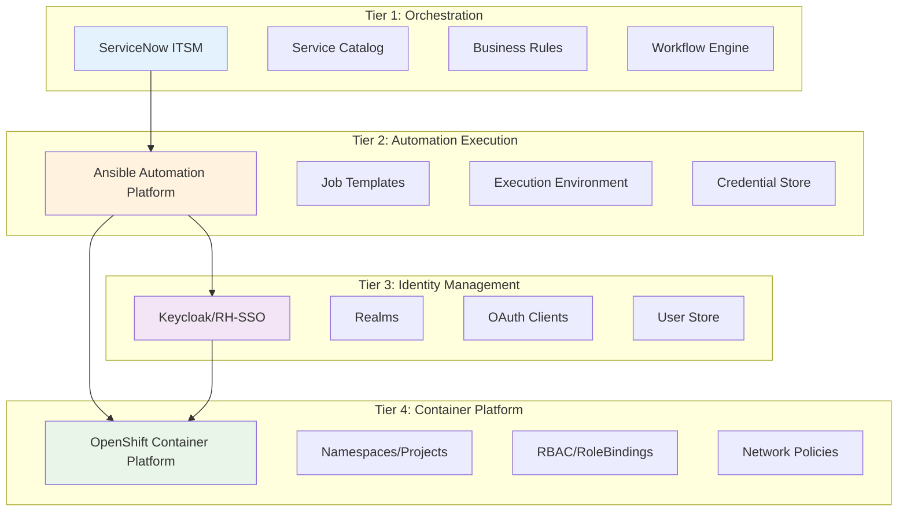
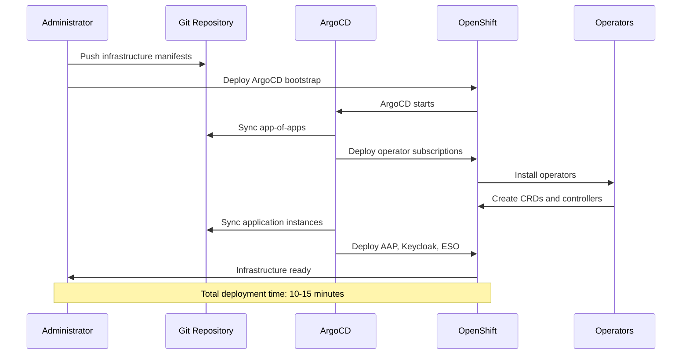
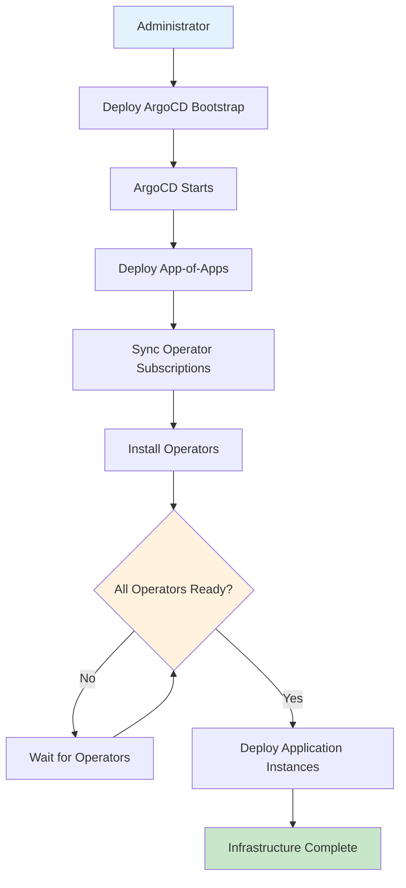
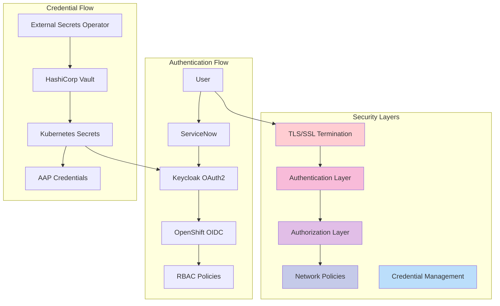
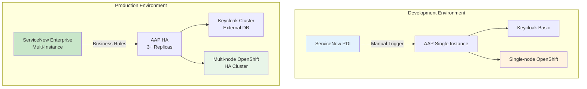
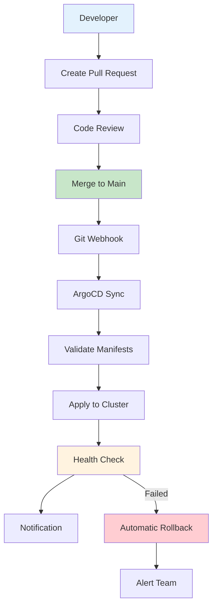
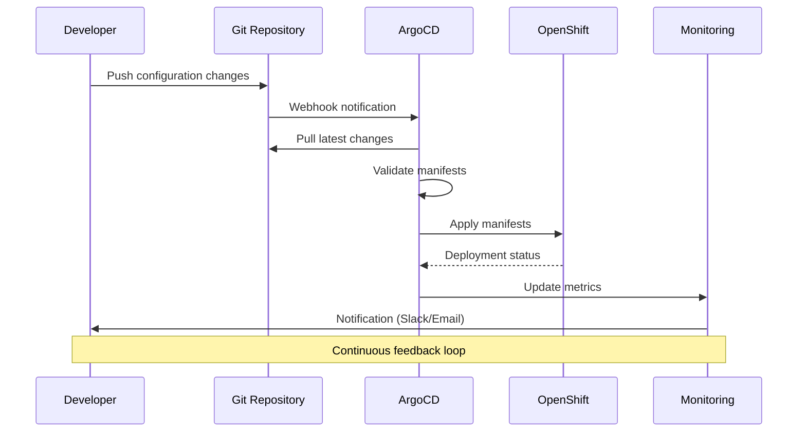
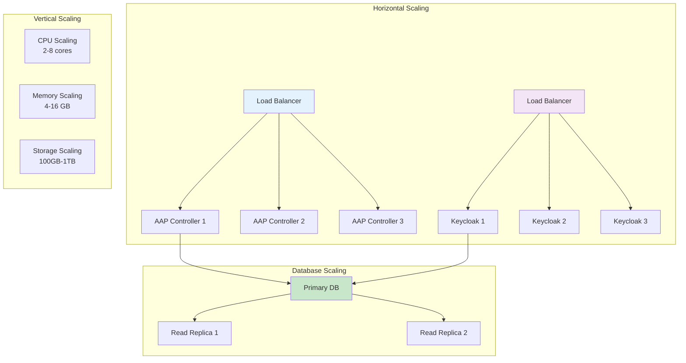

# 🏗️ Deployment Architecture

**Understanding the ServiceNow-OpenShift integration deployment patterns and infrastructure design**

## 🎯 Architecture Overview

The ServiceNow-OpenShift integration follows a **four-tier architecture** with GitOps deployment patterns, designed for enterprise-scale automation and security.



## 🚀 Deployment Patterns

### 1. GitOps-First Approach

**Infrastructure as Code** with declarative deployment:

```yaml
# kustomize/argocd/apps/app-of-apps.yaml
apiVersion: argoproj.io/v1alpha1
kind: Application
metadata:
  name: servicenow-ocp-apps
spec:
  source:
    repoURL: https://github.com/tosin2013/servicenow-ocp-service.git
    path: kustomize/argocd/apps
    targetRevision: main
  destination:
    server: https://kubernetes.default.svc
    namespace: argocd
```

**Key Benefits:**
- **Declarative**: All infrastructure defined in Git
- **Auditable**: Complete change history
- **Consistent**: Eliminates configuration drift
- **Secure**: Pull-based deployment model

### 2. Layered Kustomize Structure

**Environment-specific overlays** for different deployment targets:

```
kustomize/
├── ansible-automation-platform/
│   ├── base/                    # Base AAP configuration
│   └── overlays/
│       ├── development/         # Dev-specific settings
│       ├── staging/            # Staging configuration
│       └── production/         # Production hardening
├── rhsso/
│   ├── base/                   # Base Keycloak setup
│   └── overlays/
│       ├── crc/               # Local development
│       └── rhpds/             # RHPDS environment
└── external-secrets-operator/
    ├── base/                   # ESO base configuration
    └── overlays/
        └── vault-integration/ # Vault backend config
```

### 3. Operator-Based Deployment

**Kubernetes Operators** manage complex application lifecycles:

- **RH-SSO Operator**: Keycloak deployment and management
- **AAP Operator**: Ansible Automation Platform lifecycle
- **External Secrets Operator**: Secure credential management
- **OpenShift GitOps**: ArgoCD deployment and configuration

## 🔧 Component Deployment Flow

### Deployment Sequence Diagram



### Phase 1: Infrastructure Bootstrap



```bash
# 1. Deploy ArgoCD (OpenShift GitOps)
oc apply -k kustomize/argocd/bootstrap/

# 2. Deploy App-of-Apps pattern
oc apply -k kustomize/argocd/apps/

# 3. Wait for operator deployments
oc get pods -n sso
oc get pods -n aap
oc get pods -n external-secrets-operator
```

### Phase 2: Configuration Management

```bash
# 1. Configure base Keycloak realms and clients
./run_playbook.sh ansible/playbook.yml \
  -e @ansible/group_vars/all/vault.yml \
  --vault-password-file .vault_pass

# 2. Set up OpenShift OIDC integration
./run_playbook.sh ansible/openshift_oidc_playbook.yml \
  -e @ansible/group_vars/all/vault.yml \
  --vault-password-file .vault_pass

# 3. Configure AAP job templates and credentials
./run_playbook.sh ansible/configure_aap.yml \
  -e @ansible/group_vars/all/vault.yml \
  --vault-password-file .vault_pass
```

### Phase 3: ServiceNow Integration

```bash
# 1. Set up OAuth integration with Keycloak
./run_playbook.sh ansible/oauth_integration_playbook.yml \
  -e @ansible/group_vars/all/vault.yml \
  --vault-password-file .vault_pass

# 2. Configure ServiceNow business rules
./run_playbook.sh ansible/servicenow_business_rules.yml \
  -e @ansible/group_vars/all/vault.yml \
  --vault-password-file .vault_pass
```

## 🛡️ Security Architecture

### Security Flow Diagram



### 1. Credential Management

**External Secrets Operator** with HashiCorp Vault integration:

```yaml
apiVersion: external-secrets.io/v1beta1
kind: SecretStore
metadata:
  name: vault-backend
spec:
  provider:
    vault:
      server: "https://vault.example.com"
      path: "secret"
      version: "v2"
      auth:
        kubernetes:
          mountPath: "kubernetes"
          role: "external-secrets"
```

### 2. Network Security

**Network Policies** for micro-segmentation:

```yaml
apiVersion: networking.k8s.io/v1
kind: NetworkPolicy
metadata:
  name: aap-controller-policy
spec:
  podSelector:
    matchLabels:
      app.kubernetes.io/name: automation-controller
  policyTypes:
  - Ingress
  - Egress
  ingress:
  - from:
    - namespaceSelector:
        matchLabels:
          name: servicenow-integration
```

### 3. RBAC Integration

**OpenShift RBAC** with Keycloak group mapping:

```yaml
apiVersion: rbac.authorization.k8s.io/v1
kind: ClusterRoleBinding
metadata:
  name: servicenow-project-admins
subjects:
- kind: Group
  name: servicenow-admins
  apiGroup: rbac.authorization.k8s.io
roleRef:
  kind: ClusterRole
  name: admin
  apiGroup: rbac.authorization.k8s.io
```

## 📊 Deployment Environments

### Environment Comparison Diagram



### Development Environment

**Characteristics:**
- Single-node OpenShift (CRC) or RHPDS
- ServiceNow PDI instance
- Simplified authentication (htpasswd + Keycloak)
- Local vault for secrets
- Manual workflow execution due to PDI limitations

**Configuration:**
```yaml
# kustomize/rhsso/overlays/crc/kustomization.yaml
resources:
  - ../../base
  - oauth-rhsso-openid.yaml
  - client-secret.yaml

patches:
  - path: patch-issuer.yaml
    target:
      kind: OAuth
      name: cluster
```

### Production Environment

**Characteristics:**
- Multi-node OpenShift cluster
- Enterprise ServiceNow instance
- External identity providers
- Enterprise vault integration
- Monitoring and alerting

**Configuration:**
```yaml
# kustomize/rhsso/overlays/production/kustomization.yaml
resources:
  - ../../base
  - production-oauth.yaml
  - external-db-secret.yaml
  - monitoring-config.yaml

patches:
  - path: production-hardening.yaml
```

## 🔄 Continuous Deployment

### Complete GitOps Workflow



### GitOps Sequence Diagram



### Deployment Validation

**Automated health checks** ensure deployment success:

```bash
# Health check script
./scripts/validate-deployment.sh --environment production

# Checks performed:
# ✅ All pods running
# ✅ Services accessible
# ✅ OAuth integration working
# ✅ AAP job templates configured
# ✅ ServiceNow connectivity
```

## 📈 Scaling Considerations

### Scaling Architecture Diagram



### Horizontal Scaling

- **AAP Controller**: Multiple replicas with load balancing
- **Keycloak**: Clustered deployment with external database
- **ServiceNow**: Multiple instances with load balancer

### Vertical Scaling

- **Resource Quotas**: Per-namespace limits
- **Node Affinity**: Workload placement optimization
- **Storage Classes**: Performance-optimized storage

## 🔍 Monitoring and Observability

### Built-in OpenShift Monitoring

- **Prometheus**: Metrics collection
- **Grafana**: Visualization dashboards
- **AlertManager**: Alert routing and notification

### Custom Metrics

```yaml
apiVersion: monitoring.coreos.com/v1
kind: ServiceMonitor
metadata:
  name: aap-controller-metrics
spec:
  selector:
    matchLabels:
      app.kubernetes.io/name: automation-controller
  endpoints:
  - port: metrics
    interval: 30s
```

## 🎯 Best Practices

### 1. Infrastructure as Code
- All configurations in Git
- Environment-specific overlays
- Automated testing of manifests

### 2. Security First
- Least privilege access
- Network segmentation
- Credential rotation

### 3. Operational Excellence
- Comprehensive monitoring
- Automated backups
- Disaster recovery procedures

---

**Next Steps**: Review the [Getting Started Guide](../GETTING_STARTED.md) for step-by-step deployment instructions.
