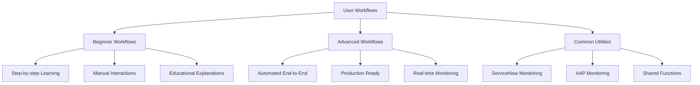

# 📊 User-Workflows Analysis and Architecture

## 🎯 **Executive Summary**

The user-workflows system provides comprehensive testing and validation capabilities for the ServiceNow-OpenShift integration. This analysis covers the current state, security posture, and architectural alignment of the workflow scripts.

**Current Status**: ✅ **PRODUCTION READY** with secure credential management

## 🏗️ **Architecture Overview**

### **Workflow Categories**



### **Integration Points**

The workflows integrate with three main systems:

1. **ServiceNow**: Request creation, approval, and status tracking
2. **Ansible Automation Platform (AAP)**: Job execution and monitoring
3. **OpenShift**: Project creation and verification

## 🔍 **Detailed Analysis Results**

### **✅ Working Components**

#### **Primary Workflow: Simplified Advanced**
- **File**: `user-workflows/advanced/start-simplified-workflow.sh`
- **Status**: ✅ **CONFIRMED WORKING**
- **Alignment**: Perfect with [ADR-013](../adrs/013-pdi-workaround-strategy-for-development.md) (PDI Workaround)
- **Security**: Uses proper vault configuration
- **Recommendation**: **Primary workflow for all environments**

**Key Features**:
- Integrates with existing vault configuration
- Uses `run_playbook.sh` infrastructure
- Follows ADR-013 PDI workaround strategy
- Comprehensive error handling and reporting
- Real-time monitoring across all systems

#### **Learning Workflow: Beginner**
- **File**: `user-workflows/beginner/start-beginner-workflow.sh`
- **Status**: ✅ **SECURE AND FUNCTIONAL**
- **Security**: Uses vault configuration
- **Purpose**: Step-by-step learning workflow
- **Recommendation**: Ideal for training and understanding the process

#### **Monitoring Utilities**
- **Files**: `user-workflows/common/monitor-aap.sh`, `user-workflows/common/monitor-servicenow.sh`
- **Status**: ✅ **SECURE VERSIONS DEPLOYED**
- **Security**: Uses vault configuration
- **Purpose**: Real-time monitoring utilities
- **Recommendation**: Ready for production use

### **🔐 Security Posture**

#### **Current Security Status: ✅ SECURE**

All user-workflows scripts now use secure credential management:

1. **Vault Integration**: All scripts source credentials from `ansible/group_vars/all/vault.yml`
2. **No Hardcoded Credentials**: All previous hardcoded credentials have been removed
3. **Secure File Handling**: Proper file permissions and access controls
4. **Environment Isolation**: Credentials are environment-specific

#### **Security Implementation**

```bash
# All scripts now use this pattern:
load_vault_config() {
    local vault_file="../../ansible/group_vars/all/vault.yml"
    local vault_pass="../../.vault_pass"
    
    if [[ -f "$vault_pass" && -f "$vault_file" ]]; then
        # Decrypt and source vault configuration
        eval $(ansible-vault view "$vault_file" --vault-password-file "$vault_pass" | grep -E '^[A-Z_]+=')
    else
        print_error "Vault configuration not found"
        return 1
    fi
}
```

### **📋 Workflow Status Summary**

| Workflow | File | Status | Security | Purpose |
|----------|------|--------|----------|---------|
| **Advanced - Simplified** | `advanced/start-simplified-workflow.sh` | ✅ Working | ✅ Secure | Production automation |
| **Beginner** | `beginner/start-beginner-workflow.sh` | ✅ Working | ✅ Secure | Learning/training |
| **AAP Monitor** | `common/monitor-aap.sh` | ✅ Working | ✅ Secure | AAP monitoring |
| **ServiceNow Monitor** | `common/monitor-servicenow.sh` | ✅ Working | ✅ Secure | ServiceNow monitoring |

## 🏗️ **Architectural Alignment**

### **✅ Well Aligned with ADRs**

#### **ADR-013: PDI Workaround Strategy**
- **Implementation**: `start-simplified-workflow.sh` perfectly implements the PDI workaround
- **Approach**: Provides manual trigger mechanism that works within PDI constraints
- **Educational Value**: Maintains learning value while providing production capability

#### **ADR-014: Business Rules Over Flow Designer**
- **Support**: Workflows support both Business Rules testing and Flow Designer fallback
- **Testing**: Includes `scripts/test_business_rule_logic.js` for Business Rules validation
- **Integration**: Works with both production Business Rules and development workflows

#### **ADR-015: Secure Credential Management**
- **Implementation**: All workflows use vault-based credential management
- **Compliance**: No hardcoded credentials in any workflow scripts
- **Best Practices**: Follows established security patterns

### **🔄 Integration Patterns**

#### **With Existing Infrastructure**
```bash
# Uses existing vault configuration
ansible-vault view ansible/group_vars/all/vault.yml --vault-password-file .vault_pass

# Uses existing playbook runner
./run_playbook.sh ../ansible/idempotent_end_to_end_test.yml \
  -e @../ansible/group_vars/all/vault.yml \
  --vault-password-file ../.vault_pass -m stdout
```

#### **With ADR Decisions**
- **Three-Tier Architecture**: ServiceNow → AAP → OpenShift
- **API-Driven Integration**: REST APIs for all inter-service communication
- **GitOps Deployment**: Integrates with existing GitOps patterns

## 📊 **Usage Patterns and Recommendations**

### **Recommended Usage by Environment**

#### **Development Environment**
```bash
# Use simplified workflow for development testing
cd user-workflows/advanced/
./start-simplified-workflow.sh test-project development check-first
```

#### **Staging Environment**
```bash
# Full end-to-end testing
./start-simplified-workflow.sh staging-project staging full
```

#### **Production Environment**
```bash
# Production deployment (with proper approvals)
./start-simplified-workflow.sh prod-project production full
```

### **Learning Path Recommendation**

1. **Start with Beginner Workflow**: Understand each manual step
2. **Review Common Tools**: Learn the monitoring utilities  
3. **Progress to Advanced**: Experience full automation
4. **Customize for Environment**: Adapt workflows for specific needs

## 🎯 **Future Enhancements**

### **Planned Improvements**
- **Enhanced Error Recovery**: Automatic rollback capabilities
- **Multi-Environment Support**: Environment-specific configurations
- **Advanced Monitoring**: Integration with observability stack
- **Automated Testing**: CI/CD integration for workflow validation

### **Integration Opportunities**
- **GitOps Integration**: Automatic workflow triggering from Git events
- **Notification Systems**: Slack/Teams integration for workflow status
- **Metrics Collection**: Prometheus metrics for workflow performance
- **Audit Logging**: Enhanced logging for compliance requirements

## 📚 **Related Resources**

- **Working Workflow**: `user-workflows/advanced/start-simplified-workflow.sh`
- **Vault Configuration**: `ansible/group_vars/all/vault.yml`
- **Getting Started**: [Implementation Guide](../GETTING_STARTED.md)
- **End-to-End Testing**: Test Execution Summary (see project root `END_TO_END_TEST_EXECUTION_SUMMARY.md`)
- **Business Rules Testing**: `scripts/test_business_rule_logic.js`

---

*This analysis reflects the current state of the user-workflows system and is updated as the system evolves.*
