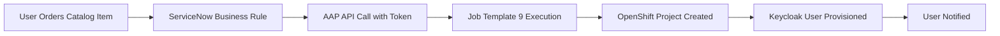

# AAP API Token Setup Guide

## 🔐 **Manual AAP Token Creation - Required for ServiceNow Integration**

### **Why Manual Token Creation?**

AAP API tokens are **security-sensitive** and should be created manually by administrators with proper permissions. This ensures:
- ✅ **Proper Authorization**: Only authorized admins can create tokens
- ✅ **Audit Trail**: Token creation is logged in AAP
- ✅ **Scope Control**: Tokens have appropriate permissions
- ✅ **Security Best Practice**: No automated credential creation

---

## 🚀 **Step-by-Step Token Creation**

### **Step 1: Access AAP Controller**
1. **Login to AAP Controller**:
   ```
   URL: https://ansible-controller-aap.apps.cluster-lgkp4.lgkp4.sandbox1321.opentlc.com
   Username: admin
   Password: [Get from OpenShift secret - see below]
   ```

2. **Get AAP Admin Password** (if needed):
   ```bash
   oc get secret automation-controller-admin-password -n aap -o jsonpath='{.data.password}' | base64 -d
   ```

### **Step 2: Navigate to Token Management**
1. **Go to User Management**:
   - Click **"Access"** in the left sidebar
   - Click **"Users"**
   - Click on **"admin"** user

2. **Access Token Section**:
   - Click the **"Tokens"** tab
   - Click **"Add"** button (+ icon)

### **Step 3: Configure the Token**
Fill out the token creation form:

| Field | Value | Notes |
|-------|-------|-------|
| **Application Type** | `Personal access token` | Required for API access |
| **Description** | `ServiceNow Integration Token` | For identification |
| **Scope** | `Write` | **CRITICAL**: Required for job execution |

### **Step 4: Generate and Copy Token**
1. **Click "Save"** to generate the token
2. **IMMEDIATELY COPY** the generated token
   - ⚠️ **WARNING**: Token is only shown once!
   - Store it securely until you add it to the vault

### **Step 5: Add Token to Vault**
1. **Edit the encrypted vault file**:
   ```bash
   ansible-vault edit ansible/group_vars/all/vault.yml --vault-password-file .vault_pass
   ```

2. **Find the AAP token line**:
   ```yaml
   vault_aap_token: "REPLACE_WITH_AAP_API_TOKEN_FROM_CONTROLLER"
   ```

3. **Replace with your actual token**:
   ```yaml
   vault_aap_token: "your_actual_token_here"
   ```

4. **Save and exit** the vault editor

---

## 🧪 **Test Token Functionality**

### **Quick Token Test**
Once you've added the token, test it works:

```bash
# Test AAP API connectivity
curl -k -H "Authorization: Bearer YOUR_TOKEN" \
  https://ansible-controller-aap.apps.cluster-lgkp4.lgkp4.sandbox1321.opentlc.com/api/v2/job_templates/9/
```

### **Run Real Integration Test**
After adding the token to the vault:

```bash
cd /home/ec2-user/servicenow-ocp-service
./run_playbook.sh ../ansible/real_aap_integration_test.yml \
  -e @../ansible/group_vars/all/vault.yml \
  --vault-password-file ../.vault_pass -m stdout
```

---

## 🔧 **Token Management Best Practices**

### **Security Guidelines**
- ✅ **Rotate tokens regularly** (every 90 days recommended)
- ✅ **Use descriptive names** for easy identification
- ✅ **Monitor token usage** in AAP logs
- ✅ **Revoke unused tokens** immediately
- ✅ **Never share tokens** between environments

### **Troubleshooting Common Issues**

| Issue | Cause | Solution |
|-------|-------|----------|
| `401 Unauthorized` | Invalid/expired token | Regenerate token |
| `403 Forbidden` | Insufficient scope | Ensure "Write" scope |
| `404 Not Found` | Wrong job template ID | Verify template exists |
| `Connection refused` | Network/firewall issue | Check AAP URL/connectivity |

### **Token Rotation Process**
1. **Create new token** following steps above
2. **Update vault** with new token
3. **Test integration** works with new token
4. **Revoke old token** in AAP Controller
5. **Document rotation** in change log

---

## 📋 **Integration Workflow After Token Setup**

Once the token is configured, the complete workflow will be:



### **Expected Results**
After token setup and running the real integration test:
- ✅ **ServiceNow catalog request** created
- ✅ **AAP job template** executed successfully
- ✅ **OpenShift project** visible with `oc get project`
- ✅ **Keycloak user** provisioned
- ✅ **Complete workflow** functional

---

## 🎯 **Next Steps After Token Creation**

1. **Add token to vault** (Step 5 above)
2. **Run real integration test** to verify functionality
3. **Configure ServiceNow business rules** for automatic triggering
4. **Test end-to-end workflow** from catalog to OpenShift
5. **Deploy to production** with proper change management

---

## 📞 **Support and Troubleshooting**

If you encounter issues:
1. **Check AAP logs** for job execution details
2. **Verify token permissions** in AAP Controller
3. **Test API connectivity** with curl commands
4. **Review ServiceNow business rule** configuration
5. **Validate job template** parameters and variables

**AAP Controller Logs Location**:
- **Job Details**: AAP Controller → Jobs → [Job ID]
- **System Logs**: AAP Controller → Administration → Logging
- **API Logs**: Check AAP pod logs in OpenShift

---

**🔐 Remember: Keep your AAP token secure and rotate it regularly!**
