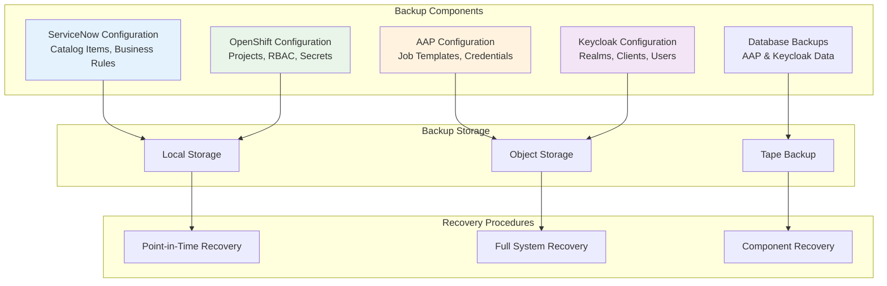
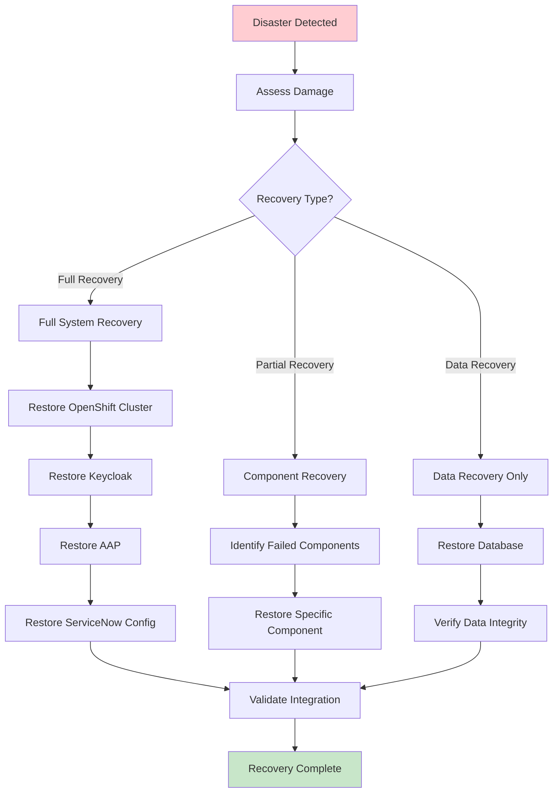

# 🛡️ Backup and Disaster Recovery

**Comprehensive backup and disaster recovery procedures for the ServiceNow-OpenShift integration**

## 🎯 Overview

This guide provides step-by-step procedures for backing up and recovering all components of the ServiceNow-OpenShift integration, ensuring business continuity and data protection.

## 📋 Backup Strategy Overview



## 🎬 Step 1: ServiceNow Configuration Backup

### 1.1 Export Catalog Items

```bash
# Create ServiceNow backup script
cat > servicenow-backup.sh << 'EOF'
#!/bin/bash
BACKUP_DATE=$(date +%Y%m%d_%H%M%S)
BACKUP_DIR="/backups/servicenow/$BACKUP_DATE"
mkdir -p $BACKUP_DIR

# Export catalog items
curl -X GET "https://dev295398.service-now.com/api/now/table/sc_cat_item" \
  -H "Accept: application/json" \
  -H "Authorization: Basic $(echo -n admin:$SERVICENOW_PASSWORD | base64)" \
  > $BACKUP_DIR/catalog_items.json

# Export business rules
curl -X GET "https://dev295398.service-now.com/api/now/table/sys_script" \
  -H "Accept: application/json" \
  -H "Authorization: Basic $(echo -n admin:$SERVICENOW_PASSWORD | base64)" \
  -G -d "sysparm_query=name=OpenShift Project Creation Trigger" \
  > $BACKUP_DIR/business_rules.json

# Export OAuth configurations
curl -X GET "https://dev295398.service-now.com/api/now/table/oauth_entity" \
  -H "Accept: application/json" \
  -H "Authorization: Basic $(echo -n admin:$SERVICENOW_PASSWORD | base64)" \
  > $BACKUP_DIR/oauth_entities.json

echo "ServiceNow backup completed: $BACKUP_DIR"
EOF

chmod +x servicenow-backup.sh
```

### 1.2 Schedule ServiceNow Backups

```yaml
# servicenow-backup-cronjob.yaml
apiVersion: batch/v1
kind: CronJob
metadata:
  name: servicenow-backup
  namespace: backup-system
spec:
  schedule: "0 1 * * *"  # Daily at 1 AM
  jobTemplate:
    spec:
      template:
        spec:
          containers:
          - name: servicenow-backup
            image: curlimages/curl:latest
            command: ["/bin/sh", "/scripts/servicenow-backup.sh"]
            env:
            - name: SERVICENOW_PASSWORD
              valueFrom:
                secretKeyRef:
                  name: servicenow-credentials
                  key: password
            volumeMounts:
            - name: backup-scripts
              mountPath: /scripts
            - name: backup-storage
              mountPath: /backups
          volumes:
          - name: backup-scripts
            configMap:
              name: backup-scripts
          - name: backup-storage
            persistentVolumeClaim:
              claimName: backup-pvc
          restartPolicy: OnFailure
```

## 🎬 Step 2: Ansible Automation Platform Backup

### 2.1 Database Backup

```bash
# AAP database backup script
cat > aap-db-backup.sh << 'EOF'
#!/bin/bash
BACKUP_DATE=$(date +%Y%m%d_%H%M%S)
BACKUP_DIR="/backups/aap/$BACKUP_DATE"
mkdir -p $BACKUP_DIR

# Backup AAP PostgreSQL database
pg_dump -h $POSTGRES_HOST -U $POSTGRES_USER -d $POSTGRES_DB \
  --no-password --verbose --format=custom \
  --file=$BACKUP_DIR/aap_database_$BACKUP_DATE.dump

# Backup AAP configuration
oc get secret -n aap -o yaml > $BACKUP_DIR/aap_secrets.yaml
oc get configmap -n aap -o yaml > $BACKUP_DIR/aap_configmaps.yaml
oc get automationcontroller -n aap -o yaml > $BACKUP_DIR/aap_instance.yaml

# Backup job templates via API
curl -X GET "https://aap-controller.apps.cluster.com/api/v2/job_templates/" \
  -H "Authorization: Bearer $AAP_TOKEN" \
  > $BACKUP_DIR/job_templates.json

# Backup credentials (metadata only, not secrets)
curl -X GET "https://aap-controller.apps.cluster.com/api/v2/credentials/" \
  -H "Authorization: Bearer $AAP_TOKEN" \
  > $BACKUP_DIR/credentials_metadata.json

echo "AAP backup completed: $BACKUP_DIR"
EOF

chmod +x aap-db-backup.sh
```

### 2.2 AAP Configuration Export

```bash
# Export AAP configuration using awx-manage
oc exec -n aap deployment/automation-controller -- \
  awx-manage export_custom_venv > aap_custom_venv_backup.json

# Export AAP settings
oc exec -n aap deployment/automation-controller -- \
  awx-manage export_settings > aap_settings_backup.json
```

## 🎬 Step 3: Keycloak Backup

### 3.1 Keycloak Realm Export

```bash
# Keycloak backup script
cat > keycloak-backup.sh << 'EOF'
#!/bin/bash
BACKUP_DATE=$(date +%Y%m%d_%H%M%S)
BACKUP_DIR="/backups/keycloak/$BACKUP_DATE"
mkdir -p $BACKUP_DIR

# Export ServiceNow realm
oc exec -n sso deployment/keycloak -- \
  /opt/keycloak/bin/kc.sh export \
  --realm servicenow \
  --file /tmp/servicenow-realm-$BACKUP_DATE.json

# Copy realm export from pod
oc cp sso/keycloak-pod:/tmp/servicenow-realm-$BACKUP_DATE.json \
  $BACKUP_DIR/servicenow-realm-$BACKUP_DATE.json

# Backup Keycloak database
pg_dump -h $KEYCLOAK_DB_HOST -U $KEYCLOAK_DB_USER -d $KEYCLOAK_DB \
  --no-password --verbose --format=custom \
  --file=$BACKUP_DIR/keycloak_database_$BACKUP_DATE.dump

# Backup Keycloak configuration
oc get keycloak -n sso -o yaml > $BACKUP_DIR/keycloak_instance.yaml
oc get secret -n sso -o yaml > $BACKUP_DIR/keycloak_secrets.yaml

echo "Keycloak backup completed: $BACKUP_DIR"
EOF

chmod +x keycloak-backup.sh
```

### 3.2 User Data Backup

```bash
# Export user data from Keycloak
KEYCLOAK_TOKEN=$(curl -X POST "https://keycloak-sso.apps.cluster.com/auth/realms/master/protocol/openid-connect/token" \
  -H "Content-Type: application/x-www-form-urlencoded" \
  -d "username=admin" \
  -d "password=$KEYCLOAK_ADMIN_PASSWORD" \
  -d "grant_type=password" \
  -d "client_id=admin-cli" | jq -r '.access_token')

# Export users
curl -X GET "https://keycloak-sso.apps.cluster.com/auth/admin/realms/servicenow/users" \
  -H "Authorization: Bearer $KEYCLOAK_TOKEN" \
  > keycloak_users_backup.json

# Export groups
curl -X GET "https://keycloak-sso.apps.cluster.com/auth/admin/realms/servicenow/groups" \
  -H "Authorization: Bearer $KEYCLOAK_TOKEN" \
  > keycloak_groups_backup.json
```

## 🎬 Step 4: OpenShift Configuration Backup

### 4.1 ETCD Backup

```bash
# Create ETCD backup script
cat > etcd-backup.sh << 'EOF'
#!/bin/bash
BACKUP_DATE=$(date +%Y%m%d_%H%M%S)
BACKUP_DIR="/var/lib/etcd-backup/$BACKUP_DATE"

# Create ETCD backup
/usr/local/bin/cluster-backup.sh $BACKUP_DIR

# Verify backup
ls -la $BACKUP_DIR/

echo "ETCD backup completed: $BACKUP_DIR"
EOF
```

### 4.2 Application Configuration Backup

```bash
# Backup OpenShift configurations
cat > openshift-config-backup.sh << 'EOF'
#!/bin/bash
BACKUP_DATE=$(date +%Y%m%d_%H%M%S)
BACKUP_DIR="/backups/openshift/$BACKUP_DATE"
mkdir -p $BACKUP_DIR

# Backup OAuth configuration
oc get oauth cluster -o yaml > $BACKUP_DIR/oauth_config.yaml

# Backup identity providers
oc get identityprovider -o yaml > $BACKUP_DIR/identity_providers.yaml

# Backup RBAC configurations
oc get clusterrolebinding -o yaml > $BACKUP_DIR/cluster_role_bindings.yaml
oc get rolebinding --all-namespaces -o yaml > $BACKUP_DIR/role_bindings.yaml

# Backup secrets in integration namespaces
oc get secret -n aap -o yaml > $BACKUP_DIR/aap_secrets.yaml
oc get secret -n sso -o yaml > $BACKUP_DIR/sso_secrets.yaml

# Backup network policies
oc get networkpolicy --all-namespaces -o yaml > $BACKUP_DIR/network_policies.yaml

echo "OpenShift configuration backup completed: $BACKUP_DIR"
EOF

chmod +x openshift-config-backup.sh
```

## 🎬 Step 5: Automated Backup Orchestration

### 5.1 Master Backup Script

```bash
# Master backup orchestration script
cat > master-backup.sh << 'EOF'
#!/bin/bash
set -e

BACKUP_DATE=$(date +%Y%m%d_%H%M%S)
LOG_FILE="/var/log/backup/master-backup-$BACKUP_DATE.log"

echo "Starting master backup at $(date)" | tee -a $LOG_FILE

# Execute all backup scripts
echo "1. Starting ServiceNow backup..." | tee -a $LOG_FILE
./servicenow-backup.sh 2>&1 | tee -a $LOG_FILE

echo "2. Starting AAP backup..." | tee -a $LOG_FILE
./aap-db-backup.sh 2>&1 | tee -a $LOG_FILE

echo "3. Starting Keycloak backup..." | tee -a $LOG_FILE
./keycloak-backup.sh 2>&1 | tee -a $LOG_FILE

echo "4. Starting OpenShift backup..." | tee -a $LOG_FILE
./openshift-config-backup.sh 2>&1 | tee -a $LOG_FILE

# Compress and upload to object storage
echo "5. Compressing backups..." | tee -a $LOG_FILE
tar -czf /backups/complete-backup-$BACKUP_DATE.tar.gz /backups/*/$BACKUP_DATE/

# Upload to S3 (or your object storage)
echo "6. Uploading to object storage..." | tee -a $LOG_FILE
aws s3 cp /backups/complete-backup-$BACKUP_DATE.tar.gz \
  s3://servicenow-integration-backups/

# Cleanup old local backups (keep last 7 days)
find /backups -type d -mtime +7 -exec rm -rf {} \;

echo "Master backup completed at $(date)" | tee -a $LOG_FILE

# Send notification
curl -X POST $SLACK_WEBHOOK_URL \
  -H 'Content-type: application/json' \
  --data "{\"text\":\"✅ ServiceNow-OpenShift integration backup completed: $BACKUP_DATE\"}"
EOF

chmod +x master-backup.sh
```

### 5.2 Schedule Master Backup

```yaml
# master-backup-cronjob.yaml
apiVersion: batch/v1
kind: CronJob
metadata:
  name: master-backup
  namespace: backup-system
spec:
  schedule: "0 2 * * 0"  # Weekly on Sunday at 2 AM
  jobTemplate:
    spec:
      template:
        spec:
          containers:
          - name: master-backup
            image: backup-tools:latest
            command: ["/bin/bash", "/scripts/master-backup.sh"]
            env:
            - name: AWS_ACCESS_KEY_ID
              valueFrom:
                secretKeyRef:
                  name: aws-credentials
                  key: access-key-id
            - name: AWS_SECRET_ACCESS_KEY
              valueFrom:
                secretKeyRef:
                  name: aws-credentials
                  key: secret-access-key
            - name: SLACK_WEBHOOK_URL
              valueFrom:
                secretKeyRef:
                  name: notification-secrets
                  key: slack-webhook
            volumeMounts:
            - name: backup-scripts
              mountPath: /scripts
            - name: backup-storage
              mountPath: /backups
          volumes:
          - name: backup-scripts
            configMap:
              name: backup-scripts
          - name: backup-storage
            persistentVolumeClaim:
              claimName: backup-pvc
          restartPolicy: OnFailure
```

## 🔄 Disaster Recovery Procedures

### Recovery Priority Matrix

| Component | RTO* | RPO** | Priority | Dependencies |
|-----------|------|-------|----------|--------------|
| **OpenShift Cluster** | 4 hours | 1 hour | Critical | None |
| **Keycloak** | 2 hours | 30 minutes | High | OpenShift |
| **AAP Controller** | 2 hours | 30 minutes | High | OpenShift, Keycloak |
| **ServiceNow Config** | 1 hour | 4 hours | Medium | None |

*RTO = Recovery Time Objective  
**RPO = Recovery Point Objective

### Recovery Workflow



## 🎬 Step 6: Recovery Procedures

### 6.1 Keycloak Recovery

```bash
# Keycloak recovery script
cat > keycloak-recovery.sh << 'EOF'
#!/bin/bash
BACKUP_FILE=$1

if [ -z "$BACKUP_FILE" ]; then
  echo "Usage: $0 <backup-file>"
  exit 1
fi

echo "Starting Keycloak recovery from $BACKUP_FILE"

# Stop Keycloak
oc scale deployment keycloak --replicas=0 -n sso

# Restore database
pg_restore -h $KEYCLOAK_DB_HOST -U $KEYCLOAK_DB_USER -d $KEYCLOAK_DB \
  --clean --if-exists --verbose $BACKUP_FILE

# Start Keycloak
oc scale deployment keycloak --replicas=3 -n sso

# Wait for pods to be ready
oc wait --for=condition=ready pod -l app=keycloak -n sso --timeout=300s

echo "Keycloak recovery completed"
EOF

chmod +x keycloak-recovery.sh
```

### 6.2 AAP Recovery

```bash
# AAP recovery script
cat > aap-recovery.sh << 'EOF'
#!/bin/bash
BACKUP_FILE=$1

if [ -z "$BACKUP_FILE" ]; then
  echo "Usage: $0 <backup-file>"
  exit 1
fi

echo "Starting AAP recovery from $BACKUP_FILE"

# Stop AAP controller
oc scale deployment automation-controller --replicas=0 -n aap

# Restore database
pg_restore -h $AAP_DB_HOST -U $AAP_DB_USER -d $AAP_DB \
  --clean --if-exists --verbose $BACKUP_FILE

# Restore configuration
oc apply -f aap_secrets.yaml
oc apply -f aap_configmaps.yaml

# Start AAP controller
oc scale deployment automation-controller --replicas=3 -n aap

# Wait for pods to be ready
oc wait --for=condition=ready pod -l app.kubernetes.io/name=automation-controller -n aap --timeout=600s

echo "AAP recovery completed"
EOF

chmod +x aap-recovery.sh
```

## ✅ Recovery Validation Checklist

### Post-Recovery Validation

- [ ] **OpenShift Cluster Health**
  ```bash
  oc get nodes
  oc get pods --all-namespaces | grep -v Running
  ```

- [ ] **Keycloak Functionality**
  ```bash
  curl -k https://keycloak-sso.apps.cluster.com/auth/realms/servicenow
  ```

- [ ] **AAP Controller Access**
  ```bash
  curl -k https://aap-controller.apps.cluster.com/api/v2/ping/
  ```

- [ ] **ServiceNow Integration**
  ```bash
  ./user-workflows/advanced/start-simplified-workflow.sh recovery-test development verify-only
  ```

- [ ] **End-to-End Workflow**
  ```bash
  cd user-workflows/advanced/
  ./start-simplified-workflow.sh recovery-validation production full
  ```

---

**🛡️ Your ServiceNow-OpenShift integration now has comprehensive backup and disaster recovery procedures to ensure business continuity.**
