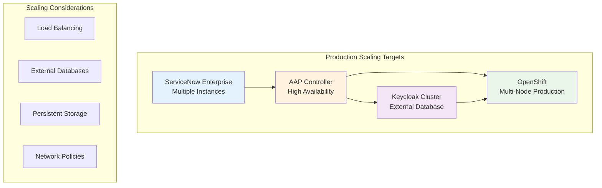

# 🚀 Scale for Production

**Step-by-step guide for scaling Ansible Automation Platform and other components for production workloads**

## 🎯 Overview

This guide helps you scale the ServiceNow-OpenShift integration from development/testing to production-ready deployment. We'll cover scaling strategies for each tier of the four-tier architecture.

## 📋 Prerequisites

Before scaling to production:

- [ ] **Working development environment** validated with end-to-end tests
- [ ] **Production OpenShift cluster** with sufficient resources
- [ ] **Enterprise ServiceNow instance** (not PDI)
- [ ] **Production Keycloak/RH-SSO** deployment
- [ ] **Monitoring and alerting** infrastructure in place

## 🏗️ Architecture Scaling Overview



## 🎬 Step 1: Scale Ansible Automation Platform

### 1.1 Assess Current Resource Usage

First, analyze your current AAP resource consumption:

```bash
# Check current AAP controller resource usage
oc get pods -n aap -o wide
oc top pods -n aap

# Check resource requests and limits
oc describe deployment automation-controller -n aap
```

### 1.2 Configure High Availability

Update your AAP deployment for production scale:

```yaml
# kustomize/ansible-automation-platform/overlays/production/aap-instance.yaml
apiVersion: automationcontroller.ansible.com/v1beta1
kind: AutomationController
metadata:
  name: automation-controller
  namespace: aap
spec:
  # High Availability Configuration
  replicas: 3  # Increased from 1
  
  # Resource Requirements
  web_resource_requirements:
    requests:
      cpu: "2"
      memory: "4Gi"
    limits:
      cpu: "4"
      memory: "8Gi"
  
  task_resource_requirements:
    requests:
      cpu: "2"
      memory: "4Gi"
    limits:
      cpu: "4"
      memory: "8Gi"
  
  # External Database (Production Requirement)
  postgres_configuration_secret: "aap-postgres-configuration"
  
  # Persistent Storage
  projects_persistence: true
  projects_storage_class: "fast-ssd"
  projects_storage_size: "100Gi"
  
  # Load Balancer Configuration
  loadbalancer_protocol: "https"
  loadbalancer_port: 443
```

### 1.3 Configure External Database

Set up external PostgreSQL for production:

```bash
# Create database configuration secret
oc create secret generic aap-postgres-configuration \
  --from-literal=host=postgres.production.com \
  --from-literal=port=5432 \
  --from-literal=database=aap_production \
  --from-literal=username=aap_user \
  --from-literal=password=SecurePassword123! \
  --from-literal=sslmode=require \
  -n aap
```

### 1.4 Apply Production Configuration

```bash
# Apply production AAP configuration
oc apply -k kustomize/ansible-automation-platform/overlays/production/

# Wait for rollout to complete
oc rollout status deployment/automation-controller -n aap

# Verify high availability
oc get pods -n aap -l app.kubernetes.io/name=automation-controller
```

## 🎬 Step 2: Scale Keycloak/RH-SSO

### 2.1 Configure Keycloak Clustering

Update Keycloak for production clustering:

```yaml
# kustomize/rhsso/overlays/production/keycloak-instance.yaml
apiVersion: keycloak.org/v1alpha1
kind: Keycloak
metadata:
  name: keycloak
  namespace: sso
spec:
  # Clustering Configuration
  instances: 3  # Increased from 1
  
  # External Database
  externalDatabase:
    enabled: true
  
  # Resource Requirements
  keycloakDeploymentSpec:
    resources:
      requests:
        cpu: "1"
        memory: "2Gi"
      limits:
        cpu: "2"
        memory: "4Gi"
  
  # Persistent Storage
  storageClassName: "fast-ssd"
  
  # Performance Tuning
  podDisruptionBudget:
    enabled: true
    minAvailable: 2
```

### 2.2 Configure External Database for Keycloak

```bash
# Create Keycloak database configuration
oc create secret generic keycloak-db-secret \
  --from-literal=POSTGRES_HOST=postgres.production.com \
  --from-literal=POSTGRES_PORT=5432 \
  --from-literal=POSTGRES_DATABASE=keycloak_production \
  --from-literal=POSTGRES_USER=keycloak_user \
  --from-literal=POSTGRES_PASSWORD=SecurePassword123! \
  -n sso
```

### 2.3 Apply Keycloak Production Configuration

```bash
# Apply production Keycloak configuration
oc apply -k kustomize/rhsso/overlays/production/

# Monitor deployment
oc get pods -n sso -w

# Verify clustering
oc logs -f deployment/keycloak -n sso | grep -i cluster
```

## 🎬 Step 3: Configure Production Resource Quotas

### 3.1 Set Namespace Resource Limits

Create production-appropriate resource quotas:

```yaml
# production-resource-quota.yaml
apiVersion: v1
kind: ResourceQuota
metadata:
  name: production-quota
  namespace: aap
spec:
  hard:
    requests.cpu: "20"
    requests.memory: "40Gi"
    limits.cpu: "40"
    limits.memory: "80Gi"
    persistentvolumeclaims: "10"
    services.loadbalancers: "3"
---
apiVersion: v1
kind: ResourceQuota
metadata:
  name: production-quota
  namespace: sso
spec:
  hard:
    requests.cpu: "10"
    requests.memory: "20Gi"
    limits.cpu: "20"
    limits.memory: "40Gi"
    persistentvolumeclaims: "5"
```

### 3.2 Apply Resource Quotas

```bash
# Apply resource quotas
oc apply -f production-resource-quota.yaml

# Verify quotas
oc describe quota production-quota -n aap
oc describe quota production-quota -n sso
```

## 🎬 Step 4: Configure Network Policies

### 4.1 Create Production Network Policies

Implement micro-segmentation for security:

```yaml
# production-network-policies.yaml
apiVersion: networking.k8s.io/v1
kind: NetworkPolicy
metadata:
  name: aap-controller-policy
  namespace: aap
spec:
  podSelector:
    matchLabels:
      app.kubernetes.io/name: automation-controller
  policyTypes:
  - Ingress
  - Egress
  ingress:
  - from:
    - namespaceSelector:
        matchLabels:
          name: servicenow-integration
    - namespaceSelector:
        matchLabels:
          name: openshift-ingress
    ports:
    - protocol: TCP
      port: 8080
  egress:
  - to:
    - namespaceSelector:
        matchLabels:
          name: sso
    ports:
    - protocol: TCP
      port: 8080
  - to: []  # Allow external database access
    ports:
    - protocol: TCP
      port: 5432
```

### 4.2 Apply Network Policies

```bash
# Apply network policies
oc apply -f production-network-policies.yaml

# Verify policies
oc get networkpolicy -n aap
oc get networkpolicy -n sso
```

## 🎬 Step 5: Configure Monitoring and Alerting

### 5.1 Enable ServiceMonitor for AAP

```yaml
# aap-service-monitor.yaml
apiVersion: monitoring.coreos.com/v1
kind: ServiceMonitor
metadata:
  name: aap-controller-metrics
  namespace: aap
spec:
  selector:
    matchLabels:
      app.kubernetes.io/name: automation-controller
  endpoints:
  - port: metrics
    interval: 30s
    path: /metrics
```

### 5.2 Create Production Alerts

```yaml
# production-alerts.yaml
apiVersion: monitoring.coreos.com/v1
kind: PrometheusRule
metadata:
  name: servicenow-integration-alerts
  namespace: aap
spec:
  groups:
  - name: aap.rules
    rules:
    - alert: AAPControllerDown
      expr: up{job="automation-controller"} == 0
      for: 5m
      labels:
        severity: critical
      annotations:
        summary: "AAP Controller is down"
        description: "AAP Controller has been down for more than 5 minutes"
    
    - alert: AAPHighMemoryUsage
      expr: container_memory_usage_bytes{pod=~"automation-controller-.*"} / container_spec_memory_limit_bytes > 0.8
      for: 10m
      labels:
        severity: warning
      annotations:
        summary: "AAP Controller high memory usage"
        description: "AAP Controller memory usage is above 80%"
```

### 5.3 Apply Monitoring Configuration

```bash
# Apply monitoring configuration
oc apply -f aap-service-monitor.yaml
oc apply -f production-alerts.yaml

# Verify monitoring
oc get servicemonitor -n aap
oc get prometheusrule -n aap
```

## 🎬 Step 6: Performance Tuning

### 6.1 Tune AAP Job Execution

Configure AAP for high-throughput job execution:

```bash
# Update AAP settings via API
curl -X PATCH https://aap-controller.apps.cluster.com/api/v2/settings/jobs/ \
  -H "Authorization: Bearer $AAP_TOKEN" \
  -H "Content-Type: application/json" \
  -d '{
    "AWX_TASK_ENV": {
      "ANSIBLE_FORCE_COLOR": "false",
      "ANSIBLE_HOST_KEY_CHECKING": "false"
    },
    "MAX_UI_JOB_EVENTS": 4000,
    "JOB_EVENT_BUFFER_SIZE": 1000,
    "DEFAULT_JOB_TIMEOUT": 3600
  }'
```

### 6.2 Optimize Keycloak Performance

```bash
# Update Keycloak realm settings for performance
# Access Keycloak admin console and configure:
# - Session timeout: 30 minutes
# - Token lifespan: 5 minutes
# - Refresh token lifespan: 30 minutes
# - Connection pool size: 20
```

## 🎬 Step 7: Backup and Disaster Recovery

### 7.1 Configure Automated Backups

```bash
# Create backup script for AAP
cat > aap-backup.sh << 'EOF'
#!/bin/bash
DATE=$(date +%Y%m%d_%H%M%S)
BACKUP_DIR="/backups/aap/$DATE"

# Create backup directory
mkdir -p $BACKUP_DIR

# Backup AAP database
pg_dump -h postgres.production.com -U aap_user aap_production > $BACKUP_DIR/aap_db_backup.sql

# Backup AAP configuration
oc get secret -n aap -o yaml > $BACKUP_DIR/aap_secrets.yaml
oc get configmap -n aap -o yaml > $BACKUP_DIR/aap_configmaps.yaml

# Backup Keycloak database
pg_dump -h postgres.production.com -U keycloak_user keycloak_production > $BACKUP_DIR/keycloak_db_backup.sql

echo "Backup completed: $BACKUP_DIR"
EOF

chmod +x aap-backup.sh
```

### 7.2 Schedule Regular Backups

```yaml
# backup-cronjob.yaml
apiVersion: batch/v1
kind: CronJob
metadata:
  name: aap-backup
  namespace: aap
spec:
  schedule: "0 2 * * *"  # Daily at 2 AM
  jobTemplate:
    spec:
      template:
        spec:
          containers:
          - name: backup
            image: postgres:13
            command: ["/bin/bash", "/scripts/aap-backup.sh"]
            volumeMounts:
            - name: backup-scripts
              mountPath: /scripts
            - name: backup-storage
              mountPath: /backups
          volumes:
          - name: backup-scripts
            configMap:
              name: backup-scripts
          - name: backup-storage
            persistentVolumeClaim:
              claimName: backup-pvc
          restartPolicy: OnFailure
```

## 🎬 Step 8: Validate Production Deployment

### 8.1 Run Production Readiness Tests

```bash
# Execute comprehensive validation
cd user-workflows/advanced/
./start-simplified-workflow.sh production-test production full

# Run load testing
for i in {1..10}; do
  ./start-simplified-workflow.sh "load-test-$i" production create-request &
done
wait

# Verify all projects created
oc get projects | grep load-test
```

### 8.2 Performance Validation

```bash
# Check response times
curl -w "@curl-format.txt" -o /dev/null -s https://aap-controller.apps.cluster.com/api/v2/ping/

# Monitor resource usage during load
oc top pods -n aap
oc top pods -n sso

# Check job execution times
oc logs -f deployment/automation-controller -n aap | grep "Job.*completed"
```

## ✅ Production Readiness Checklist

### Infrastructure
- [ ] **High Availability**: AAP and Keycloak running with 3+ replicas
- [ ] **External Databases**: PostgreSQL configured for both AAP and Keycloak
- [ ] **Persistent Storage**: Fast SSD storage classes configured
- [ ] **Load Balancing**: Production load balancers configured
- [ ] **Network Policies**: Micro-segmentation implemented

### Security
- [ ] **TLS Certificates**: Valid certificates for all endpoints
- [ ] **RBAC**: Proper role-based access control configured
- [ ] **Secrets Management**: All credentials in encrypted secrets
- [ ] **Network Security**: Ingress/egress policies implemented

### Monitoring
- [ ] **Metrics Collection**: ServiceMonitors configured
- [ ] **Alerting**: Critical alerts configured and tested
- [ ] **Logging**: Centralized logging configured
- [ ] **Dashboards**: Grafana dashboards for operational visibility

### Backup & Recovery
- [ ] **Automated Backups**: Daily backups scheduled
- [ ] **Backup Testing**: Restore procedures tested
- [ ] **Disaster Recovery**: DR plan documented and tested

### Performance
- [ ] **Load Testing**: System tested under expected load
- [ ] **Resource Sizing**: Appropriate resource limits set
- [ ] **Performance Tuning**: AAP and Keycloak optimized
- [ ] **Capacity Planning**: Growth projections documented

---

**🎉 Congratulations!** Your ServiceNow-OpenShift integration is now production-ready with enterprise-grade scaling, security, and reliability.
