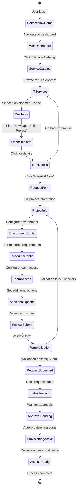
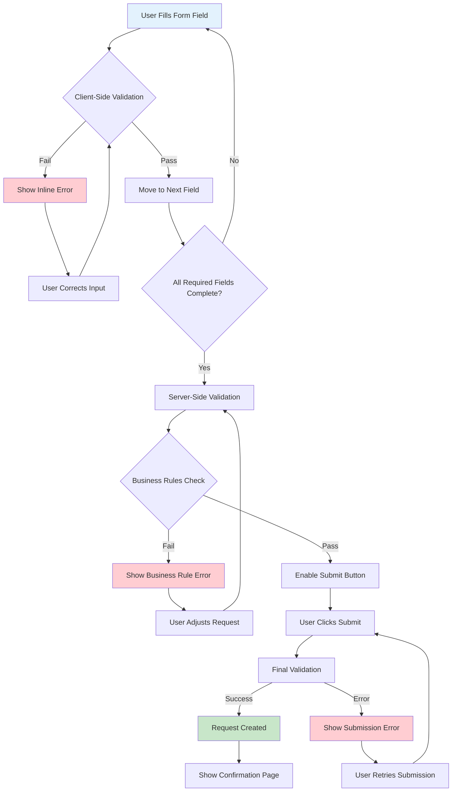
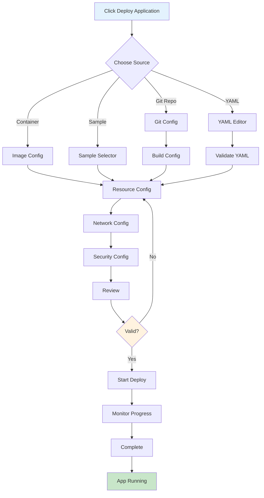
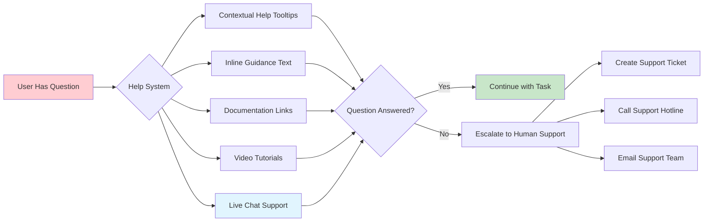

# ServiceNow-OpenShift Integration: User Experience Guide

This document provides detailed user experience flows, interface mockups, and functional diagrams for the ServiceNow-OpenShift integration system.

## Table of Contents

1. [User Personas and Journey Maps](#user-personas-and-journey-maps)
2. [Detailed User Interface Flows](#detailed-user-interface-flows)
3. [ServiceNow Interface Mockups](#servicenow-interface-mockups)
4. [OpenShift User Experience](#openshift-user-experience)
5. [Mobile and Accessibility Considerations](#mobile-and-accessibility-considerations)
6. [User Support and Help Systems](#user-support-and-help-systems)

## User Personas and Journey Maps

### Primary User Personas

#### 1. Application Developer
- **Role**: Develops and deploys applications
- **Goals**: Quick project setup, easy deployment, clear resource limits
- **Pain Points**: Complex approval processes, unclear resource requirements
- **Experience Level**: Intermediate with containers, beginner with OpenShift

#### 2. DevOps Engineer
- **Role**: Manages deployment pipelines and infrastructure
- **Goals**: Standardized environments, automated provisioning, monitoring
- **Pain Points**: Manual setup processes, inconsistent configurations
- **Experience Level**: Advanced with OpenShift and automation

#### 3. Project Manager
- **Role**: Oversees project delivery and resource allocation
- **Goals**: Visibility into resource usage, cost control, team coordination
- **Pain Points**: Lack of visibility, approval bottlenecks
- **Experience Level**: Beginner with technical platforms

### Complete User Journey Map


## Detailed User Interface Flows

### ServiceNow Portal Navigation Flow



### Form Validation and Error Handling Flow



## ServiceNow Interface Mockups

### Enhanced Service Catalog Item Page

```
┌─────────────────────────────────────────────────────────────────┐
│ 🏠 ServiceNow Portal > Service Catalog > IT Services           │
├─────────────────────────────────────────────────────────────────┤
│                                                                 │
│ 🐳 New OpenShift Project                                ⭐ 4.8  │
│                                                                 │
│ ┌─────────────────────────────────────────────────────────────┐ │
│ │ 📝 Description                                             │ │
│ │ Request a new containerized application project on our     │ │
│ │ enterprise OpenShift platform. This service provides      │ │
│ │ automated provisioning of:                                 │ │
│ │ • Dedicated project namespace with RBAC                   │ │
│ │ • Resource quotas and limits                              │ │
│ │ • Monitoring and logging integration                      │ │
│ │ • Team-based access management                            │ │
│ └─────────────────────────────────────────────────────────────┘ │
│                                                                 │
│ ⏱️ Typical Fulfillment Time: 2-4 hours                         │
│ 💰 Cost: Charged based on resource usage                       │
│ 🔒 Approval Required: Manager + Platform Team                  │
│                                                                 │
│ ┌─────────────────┐  ┌─────────────────┐  ┌─────────────────┐  │
│ │ 📋 Prerequisites │  │ 🎯 What You Get │  │ 🔧 Next Steps   │  │
│ │                 │  │                 │  │                 │  │
│ │ • Valid Corp ID │  │ • OpenShift     │  │ • Deploy apps   │  │
│ │ • Manager       │  │   project       │  │ • Set up CI/CD  │  │
│ │   approval      │  │ • Team access   │  │ • Configure     │  │
│ │ • Basic resource│  │ • Resource      │  │   monitoring    │  │
│ │   estimates     │  │   quotas        │  │ • Add secrets   │  │
│ └─────────────────┘  └─────────────────┘  └─────────────────┘  │
│                                                                 │
│ 📊 Recent Activity                                              │
│ • 12 requests this month  • 95% approval rate  • 2.3h avg time │
│                                                                 │
│ ┌─────────────────────┐  ┌─────────────────────┐              │
│ │   📖 Documentation  │  │    🚀 Request Now   │              │
│ └─────────────────────┘  └─────────────────────┘              │
│                                                                 │
│ 💬 Reviews and Comments                                         │
│ ⭐⭐⭐⭐⭐ "Great service! Project was ready in 90 minutes!"    │
│ ⭐⭐⭐⭐⭐ "Easy to use form and excellent documentation"       │
│ ⭐⭐⭐⭐☆ "Could use better resource estimation guidance"       │
│                                                                 │
└─────────────────────────────────────────────────────────────────┘
```

### Multi-Step Request Form with Progress Indicator

```
┌─────────────────────────────────────────────────────────────────┐
│ New OpenShift Project Request                           [× Close] │
├─────────────────────────────────────────────────────────────────┤
│                                                                 │
│ Progress: ●●●○○ Step 3 of 5 - Resource Configuration            │
│                                                                 │
│ ┌─────────────────────────────────────────────────────────────┐ │
│ │ 📈 Resource Requirements                                    │ │
│ │                                                             │ │
│ │ Environment Type: ◉ Development                            │ │
│ │                                                             │ │
│ │ ┌─────────────────┐  ┌─────────────────┐                   │ │
│ │ │ 🖥️ Compute       │  │ 💾 Storage      │                   │ │
│ │ │                 │  │                 │                   │ │
│ │ │ CPU Cores *     │  │ Persistent      │                   │ │
│ │ │ [2 ▼]          │  │ Storage (GB) *  │                   │ │
│ │ │                 │  │ [20 ▼]         │                   │ │
│ │ │ Memory (GB) *   │  │                 │                   │ │
│ │ │ [4 ▼]          │  │ Backup Required │                   │ │
│ │ │                 │  │ ☐ Yes ☑ No     │                   │ │
│ │ │ Pod Limit       │  │                 │                   │ │
│ │ │ [10 ▼]         │  │                 │                   │ │
│ │ └─────────────────┘  └─────────────────┘                   │ │
│ │                                                             │ │
│ │ 💡 Resource Estimation Help                                 │ │
│ │ Based on your environment type, we recommend:              │ │
│ │ • Small app (1-2 services): 1 CPU, 2GB RAM, 10GB storage  │ │
│ │ • Medium app (3-5 services): 2 CPU, 4GB RAM, 20GB storage │ │
│ │ • Large app (6+ services): 4 CPU, 8GB RAM, 50GB storage   │ │
│ │                                                             │ │
│ │ 💰 Estimated Monthly Cost: $45.00                          │ │
│ │ [📊 Show cost breakdown]                                   │ │
│ └─────────────────────────────────────────────────────────────┘ │
│                                                                 │
│ ⚠️ Quota Limits                                                 │
│ Your department has 12 CPU cores remaining in quota            │
│                                                                 │
│ ┌─────────────────────┐  ┌─────────────────────┐              │
│ │    [← Previous]     │  │      [Next →]       │              │
│ └─────────────────────┘  └─────────────────────┘              │
│                                                                 │
│ [💾 Save Draft] [❌ Cancel] [❓ Get Help]                      │
└─────────────────────────────────────────────────────────────────┘
```

### Advanced Request Status Dashboard

```
┌─────────────────────────────────────────────────────────────────┐
│ My Requests Dashboard                           🔄 Auto-refresh  │
├─────────────────────────────────────────────────────────────────┤
│                                                                 │
│ 📊 Overview                                                     │
│ ┌─────────────────┐ ┌─────────────────┐ ┌─────────────────┐    │
│ │ 🟢 Active: 2    │ │ ⏳ Pending: 1   │ │ ✅ Complete: 8  │    │
│ └─────────────────┘ └─────────────────┘ └─────────────────┘    │
│                                                                 │
│ 📋 Current Requests                                             │
│                                                                 │
│ ┌─────────────────────────────────────────────────────────────┐ │
│ │ REQ0001234 - New OpenShift Project                🔄 Active │ │
│ │ ───────────────────────────────────────────────────────────  │ │
│ │ Project: my-app-dev          Submitted: Sep 9, 10:30 AM    │ │
│ │                                                             │ │
│ │ Progress: ✅ ✅ 🔄 ⏳ ⏳                                     │ │
│ │          Sub  Mgr  Plat Sec Prov                           │ │
│ │                                                             │ │
│ │ Current Stage: Platform Team Review                        │ │
│ │ Assigned To: DevOps Team                                   │ │
│ │ ETA: Sep 9, 2:00 PM                                        │ │
│ │                                                             │ │
│ │ 📧 Latest Update (11:45 AM): Platform team reviewing       │ │
│ │    resource requirements. May need adjustment for storage. │ │
│ │                                                             │ │
│ │ [📞 Contact Assignee] [📧 Request Update] [📋 View Details]│ │
│ └─────────────────────────────────────────────────────────────┘ │
│                                                                 │
│ ┌─────────────────────────────────────────────────────────────┐ │
│ │ REQ0001229 - Database Instance                ⏳ Pending   │ │
│ │ ───────────────────────────────────────────────────────────  │ │
│ │ Project: analytics-db        Submitted: Sep 8, 3:15 PM     │ │
│ │                                                             │ │
│ │ Progress: ✅ ⏳ ⏳ ⏳ ⏳                                     │ │
│ │          Sub  Mgr  Plat Sec Prov                           │ │
│ │                                                             │ │
│ │ Current Stage: Waiting for Manager Approval               │ │
│ │ Pending With: Sarah Johnson                                │ │
│ │ ETA: Sep 9, 5:00 PM                                        │ │
│ │                                                             │ │
│ │ [🔔 Send Reminder] [✏️ Edit Request] [❌ Cancel]          │ │
│ └─────────────────────────────────────────────────────────────┘ │
│                                                                 │
│ 🔍 Filter: [All Requests ▼] [Last 30 Days ▼] [🔍 Search]      │
│                                                                 │
└─────────────────────────────────────────────────────────────────┘
```

## OpenShift User Experience

### Enhanced Project Dashboard with Onboarding

```
┌─────────────────────────────────────────────────────────────────┐
│ 🎯 Welcome to your new OpenShift project!                      │
├─────────────────────────────────────────────────────────────────┤
│                                                                 │
│ Project: my-app-dev                     👋 First time here?    │
│                                                                 │
│ ┌─────────────────────────────────────────────────────────────┐ │
│ │ 🚀 Quick Start Checklist                            [Hide] │ │
│ │                                                             │ │
│ │ ☑️  1. Explore your project dashboard                      │ │
│ │ ☐  2. Deploy your first application                       │ │
│ │ ☐  3. Set up image pull secrets                           │ │
│ │ ☐  4. Configure CI/CD pipeline                            │ │
│ │ ☐  5. Enable monitoring and alerts                        │ │
│ │                                                             │ │
│ │ [📖 View Complete Getting Started Guide]                   │ │
│ └─────────────────────────────────────────────────────────────┘ │
│                                                                 │
│ ┌─────────────────┐  ┌─────────────────┐  ┌─────────────────┐  │
│ │ 📊 Resources    │  │ 👥 Team Access  │  │ 🔧 Quick Deploy │  │
│ │                 │  │                 │  │                 │  │
│ │ CPU: ▓░░░ 25%   │  │ 3 team members  │  │ [🐳 From Image] │  │
│ │ 0.5 / 2.0 cores │  │ 2 developers    │  │ [📝 From YAML]  │  │
│ │                 │  │ 1 admin         │  │ [🔗 From Git]   │  │
│ │ RAM: ▓░░░ 12%   │  │                 │  │ [📁 Upload]     │  │
│ │ 0.5 / 4.0 GB    │  │ [➕ Add Member] │  │                 │  │
│ │                 │  │                 │  │ [📋 Samples]    │ │
│ │ Storage: ░░░░ 0%│  │ [⚙️ Manage]     │  │                 │  │
│ │ 0 / 20 GB       │  │                 │  │                 │  │
│ │                 │  │                 │  │                 │  │
│ │ Pods: ░░░░ 0/10 │  │                 │  │                 │  │
│ └─────────────────┘  └─────────────────┘  └─────────────────┘  │
│                                                                 │
│ 📈 Project Health                    🔔 Recent Notifications   │
│ ┌─────────────────┐                  ┌─────────────────┐       │
│ │ ✅ All systems  │                  │ 🎉 Project      │       │
│ │    operational  │                  │    created      │       │
│ │                 │                  │    successfully │       │
│ │ 🟢 0 issues     │                  │ 2 min ago       │       │
│ │ 🟡 0 warnings   │                  │                 │       │
│ │ 🔴 0 critical   │                  │ 📧 Welcome      │       │
│ │                 │                  │    email sent   │       │
│ │ [📊 Details]    │                  │ 1 min ago       │       │
│ └─────────────────┘                  └─────────────────┘       │
│                                                                 │
└─────────────────────────────────────────────────────────────────┘
```

### Application Deployment Wizard



## Mobile and Accessibility Considerations

### Mobile-Responsive ServiceNow Interface

```
┌─────────────────────────────┐
│ ☰ ServiceNow         🔍 👤 │
├─────────────────────────────┤
│                             │
│ 🏠 Home                     │
│ 📋 My Requests              │
│ 🛒 Service Catalog          │
│ 📊 My Dashboard             │
│                             │
│ ┌─────────────────────────┐ │
│ │ 🔥 Popular Services     │ │
│ │                         │ │
│ │ 🐳 OpenShift Project    │ │
│ │ Request new container   │ │
│ │ platform project        │ │
│ │ [Request →]             │ │
│ │                         │ │
│ │ 🗄️ Database Instance    │ │
│ │ Request new database    │ │
│ │ for your project        │ │
│ │ [Request →]             │ │
│ └─────────────────────────┘ │
│                             │
│ ┌─────────────────────────┐ │
│ │ 📊 My Active Requests   │ │
│ │                         │ │
│ │ REQ001234              │ │
│ │ OpenShift Project       │ │
│ │ 🔄 In Progress          │ │
│ │ Platform Team Review    │ │
│ │ [View →]                │ │
│ └─────────────────────────┘ │
│                             │
└─────────────────────────────┘
```

### Accessibility Features

1. **Screen Reader Support**
   - Semantic HTML structure
   - ARIA labels and descriptions
   - Keyboard navigation support
   - High contrast mode compatibility

2. **Visual Accessibility**
   - Color-blind friendly color schemes
   - Scalable text and icons
   - Clear visual hierarchy
   - Sufficient color contrast ratios

3. **Motor Accessibility**
   - Large click targets (minimum 44px)
   - Keyboard-only navigation
   - Voice control compatibility
   - Gesture alternatives

## User Support and Help Systems

### Contextual Help System



### Progressive Help Disclosure

```
┌─────────────────────────────────────────────────────────────────┐
│ Project Name * [my-app-dev                              ] [?]   │
├─────────────────────────────────────────────────────────────────┤
│ ℹ️ Help: Project Name                                           │
│                                                                 │
│ Choose a unique name for your project. This will be used as:   │
│ • The OpenShift namespace identifier                           │
│ • The URL subdomain for your applications                      │
│ • The default prefix for created resources                     │
│                                                                 │
│ 📋 Naming Requirements:                                         │
│ • 3-20 characters long                                         │
│ • Lowercase letters, numbers, and hyphens only                │
│ • Must start and end with a letter or number                  │
│ • Must be unique across the organization                       │
│                                                                 │
│ ✅ Good examples: my-app-dev, user-portal, api-gateway         │
│ ❌ Bad examples: My-App, api_gateway, -test-, myapp-           │
│                                                                 │
│ 🔍 [Check name availability]                                   │
│                                                                 │
│ [📖 View complete naming guide] [❌ Close help]                │
└─────────────────────────────────────────────────────────────────┘
```

This comprehensive user experience guide provides:

1. **Detailed user personas** and complete journey mapping
2. **Interactive interface mockups** showing real user interfaces
3. **Step-by-step workflow diagrams** with decision points and error handling
4. **Mobile and accessibility considerations** for inclusive design
5. **Progressive help systems** that scale from simple tooltips to full documentation
6. **Error handling and support escalation** pathways

The documentation ensures users understand exactly what to expect when interacting with the ServiceNow-OpenShift integration system, from initial discovery through successful project deployment and ongoing management.
