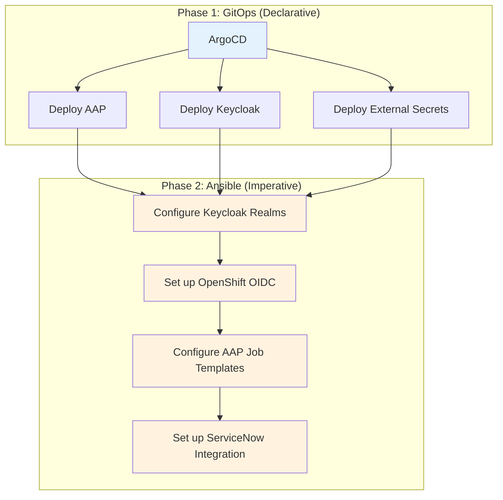

# Understanding Ansible Automation for Developers

**A developer-focused guide to understanding and working with the Ansible automation in the ServiceNow-OpenShift integration**

## 🎯 What You'll Learn

By the end of this tutorial, you'll understand:
- ✅ How Ansible fits into the ServiceNow-OpenShift integration architecture
- ✅ The hybrid GitOps + Ansible configuration strategy
- ✅ Key playbooks and roles in the project
- ✅ How to run, test, and debug Ansible automation
- ✅ The relationship between Ansible and AAP (Ansible Automation Platform)

**⏱️ Estimated Time**: 25-30 minutes

## 🏗️ Ansible in the Architecture

### The Hybrid Approach
The ServiceNow-OpenShift integration uses a **hybrid GitOps + Ansible** strategy:



### Why This Approach?
- **GitOps** handles infrastructure deployment (containers, operators)
- **Ansible** handles application configuration (realms, clients, job templates)
- **Clear separation** between infrastructure and configuration concerns

## 📁 Ansible Project Structure

### Directory Layout
```bash
ansible/
├── playbook.yml                    # Main configuration playbook
├── preflight_checks.yml           # Connectivity validation
├── configure_aap.yml              # AAP job template setup
├── oauth_integration_playbook.yml # OAuth configuration
├── openshift_oidc_playbook.yml    # OpenShift OIDC setup
├── servicenow_*.yml               # ServiceNow integration playbooks
├── roles/                         # Reusable automation roles
│   ├── rhsso_servicenow_config/   # Keycloak-ServiceNow OAuth
│   ├── openshift_oidc_integration/ # OpenShift OIDC setup
│   ├── aap_configuration/         # AAP job templates
│   └── servicenow_flow_designer/  # ServiceNow workflows
├── group_vars/all/                # Global variables
│   ├── vault.yml                  # Encrypted credentials
│   └── vault.yml.template         # Credential template
└── templates/                     # Jinja2 templates
    ├── namespace.yaml.j2          # OpenShift namespace
    ├── rbac-permissions.yaml.j2   # RBAC configuration
    └── resource-quotas.yaml.j2    # Resource limits
```

## 🚀 Key Playbooks Explained

### 1. **Main Configuration Playbook** (`playbook.yml`)
**Purpose**: Configure base Keycloak realms and clients

```yaml
# Core functionality:
- name: Configure RH-SSO for ServiceNow Integration
  hosts: localhost
  roles:
    - rhsso_servicenow_config
```

**When to run**: After GitOps deployment, before other configurations

### 2. **Pre-flight Checks** (`preflight_checks.yml`)
**Purpose**: Validate connectivity to all systems

```yaml
# Validates:
- ServiceNow API connectivity
- Keycloak admin access
- OpenShift cluster access
- AAP controller access
```

**When to run**: Before any configuration changes

### 3. **AAP Configuration** (`configure_aap.yml`)
**Purpose**: Set up AAP job templates and credentials

```yaml
# Creates:
- AAP projects from Git repositories
- Job templates for automation
- Credentials for external systems
- Inventory for target hosts
```

**When to run**: After AAP deployment and token setup

### 4. **OAuth Integration** (`oauth_integration_playbook.yml`)
**Purpose**: Configure OAuth between ServiceNow and Keycloak

```yaml
# Configures:
- ServiceNow OAuth profiles
- Application registry entries
- Connection aliases
- OAuth client credentials
```

**When to run**: After base Keycloak configuration

### 5. **OpenShift OIDC** (`openshift_oidc_playbook.yml`)
**Purpose**: Configure OpenShift to use Keycloak for authentication

```yaml
# Sets up:
- OpenShift OAuth configuration
- Identity provider settings
- Group synchronization
- RBAC mappings
```

**When to run**: After Keycloak realm configuration

## 🔧 Key Ansible Roles

### 1. **rhsso_servicenow_config**
**Purpose**: Complete Keycloak-ServiceNow OAuth integration

**Key tasks**:
- Create ServiceNow realm in Keycloak
- Configure OAuth clients and flows
- Set up ServiceNow OAuth profiles
- Test OAuth connectivity

**Variables**:
```yaml
keycloak_admin_password: "{{ vault_keycloak_password }}"
servicenow_instance_url: "{{ vault_servicenow_url }}"
servicenow_oauth_client_id: "servicenow_oauth_client"
```

### 2. **openshift_oidc_integration**
**Purpose**: Configure OpenShift OIDC with Keycloak

**Key tasks**:
- Configure OpenShift OAuth resource
- Set up identity provider
- Create group mappings
- Test OIDC flow

### 3. **aap_configuration**
**Purpose**: Configure AAP job templates and projects

**Key tasks**:
- Create AAP projects from Git
- Configure job templates
- Set up credentials
- Configure inventories

### 4. **servicenow_flow_designer**
**Purpose**: Configure ServiceNow workflows (legacy)

**Note**: Replaced by Business Rules approach (ADR-014)

## 🎮 Running Ansible Playbooks

### Using the run_playbook.sh Script
The project provides a wrapper script for consistent execution:

```bash
# Basic syntax
./run_playbook.sh <playbook> -e @<vars> --vault-password-file <vault_pass> -m <mode>

# Examples:
# 1. Run pre-flight checks
./run_playbook.sh ../ansible/preflight_checks.yml \
  -e @../ansible/group_vars/all/vault.yml \
  --vault-password-file ../.vault_pass -m stdout

# 2. Configure base Keycloak setup
./run_playbook.sh ../ansible/playbook.yml \
  -e @../ansible/group_vars/all/vault.yml \
  --vault-password-file ../.vault_pass -m stdout

# 3. Set up AAP job templates
./run_playbook.sh ../ansible/configure_aap.yml \
  -e @../ansible/group_vars/all/vault.yml \
  --vault-password-file ../.vault_pass -m stdout
```

### Direct ansible-playbook Execution
```bash
# From project root
cd ansible/

# Run with vault
ansible-playbook playbook.yml \
  -e @group_vars/all/vault.yml \
  --vault-password-file ../.vault_pass

# Run with extra variables
ansible-playbook configure_aap.yml \
  -e @group_vars/all/vault.yml \
  -e "aap_controller_url=https://my-aap.example.com" \
  --vault-password-file ../.vault_pass
```

## 🧪 Testing and Debugging

### 1. **Syntax Check**
```bash
# Check playbook syntax
ansible-playbook --syntax-check playbook.yml

# Check role syntax
ansible-playbook --syntax-check -e "role_name=rhsso_servicenow_config" test-role.yml
```

### 2. **Dry Run (Check Mode)**
```bash
# See what would change without making changes
ansible-playbook playbook.yml --check \
  -e @group_vars/all/vault.yml \
  --vault-password-file ../.vault_pass
```

### 3. **Verbose Output**
```bash
# Increase verbosity for debugging
ansible-playbook playbook.yml -vvv \
  -e @group_vars/all/vault.yml \
  --vault-password-file ../.vault_pass
```

### 4. **Tag-based Execution**
```bash
# Run only specific tagged tasks
ansible-playbook playbook.yml --tags "keycloak_setup" \
  -e @group_vars/all/vault.yml \
  --vault-password-file ../.vault_pass

# Skip specific tags
ansible-playbook playbook.yml --skip-tags "servicenow_config" \
  -e @group_vars/all/vault.yml \
  --vault-password-file ../.vault_pass
```

## 🔄 Ansible + AAP Integration

### Local Development vs Production

**Local Development**:
```bash
# Run playbooks directly with ansible-playbook
ansible-playbook configure_aap.yml -e @vault.yml --vault-password-file .vault_pass
```

**Production (via AAP)**:
```bash
# Playbooks run inside execution environment via AAP job templates
# Triggered by ServiceNow Business Rules or manual execution
```

### Job Template Mapping
| Local Playbook | AAP Job Template | Purpose |
|----------------|------------------|---------|
| `playbook.yml` | "Configure Base Keycloak" | Initial Keycloak setup |
| `configure_aap.yml` | "Setup AAP Configuration" | AAP job template creation |
| `oauth_integration_playbook.yml` | "ServiceNow OAuth Setup" | OAuth integration |
| `openshift_oidc_playbook.yml` | "OpenShift OIDC Setup" | OIDC configuration |

## 🎯 Developer Workflow

### 1. **Development Cycle**
```bash
# 1. Make changes to playbook/role
vim ansible/roles/rhsso_servicenow_config/tasks/main.yml

# 2. Test syntax
ansible-playbook --syntax-check playbook.yml

# 3. Run in check mode
ansible-playbook playbook.yml --check -e @vault.yml --vault-password-file .vault_pass

# 4. Run for real
./run_playbook.sh ../ansible/playbook.yml -e @../ansible/group_vars/all/vault.yml --vault-password-file ../.vault_pass -m stdout

# 5. Validate results
./run_playbook.sh ../ansible/preflight_checks.yml -e @../ansible/group_vars/all/vault.yml --vault-password-file ../.vault_pass -m stdout
```

### 2. **Testing New Roles**
```bash
# Create test playbook for role
cat > test-my-role.yml << EOF
---
- hosts: localhost
  roles:
    - my_new_role
EOF

# Test the role
ansible-playbook test-my-role.yml -e @vault.yml --vault-password-file .vault_pass
```

### 3. **Debugging Failed Tasks**
```bash
# Run with maximum verbosity
ansible-playbook playbook.yml -vvvv -e @vault.yml --vault-password-file .vault_pass

# Use ansible debugger
ansible-playbook playbook.yml --step -e @vault.yml --vault-password-file .vault_pass

# Check specific task output
ansible-playbook playbook.yml --start-at-task "Configure OAuth client" -e @vault.yml --vault-password-file .vault_pass
```

## 🔗 Next Steps

After understanding Ansible automation:

1. **[Ansible Vault Configuration](ansible-vault-configuration.md)** - Set up credentials
2. **[Working with Ansible](../how-to/working-with-ansible.md)** - Advanced Ansible tasks
3. **[Execution Environment Guide](execution-environment-guide.md)** - Container environment
4. **[Ansible Reference](../reference/ansible-reference.md)** - Complete technical details

## 📚 Additional Resources

- **[ADR-009: Hybrid GitOps and Ansible](../adrs/009-hybrid-gitops-and-ansible-configuration.md)** - Strategy decision
- **[ADR-010: AAP Integration](../adrs/010-ansible-automation-platform-integration.md)** - AAP architecture
- **[Role Documentation](../../ansible/roles/)** - Individual role README files
- **[Ansible Best Practices](https://docs.ansible.com/ansible/latest/user_guide/playbooks_best_practices.html)** - Official docs

---
*Understanding Ansible automation is essential for ServiceNow-OpenShift integration development*
