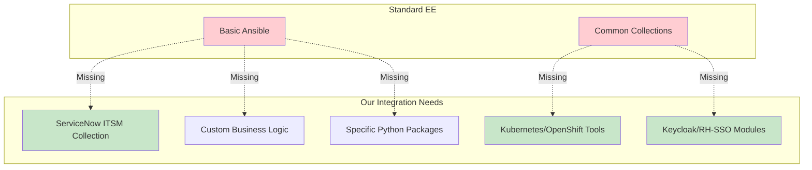

# Understanding Execution Environments for Developers

**A developer-focused guide to understanding and working with the ServiceNow-OpenShift integration execution environment**

## 🎯 What You'll Learn

By the end of this tutorial, you'll understand:
- ✅ What an execution environment is and why it's critical
- ✅ How the ServiceNow-OpenShift integration uses execution environments
- ✅ How to work with the custom execution environment as a developer
- ✅ How to test and validate execution environment functionality

**⏱️ Estimated Time**: 20-25 minutes

## 🤔 What is an Execution Environment?

An **Execution Environment (EE)** is a container image that packages everything needed to run Ansible automation:

- **Ansible Core** - The automation engine
- **Python Dependencies** - Required Python packages
- **Ansible Collections** - Pre-installed automation modules
- **System Tools** - CLI tools like `oc`, `kubectl`, `curl`
- **Custom Modules** - Project-specific automation code

Think of it as a **"batteries-included" container** that ensures your automation runs consistently everywhere.

## 🏗️ Why Do We Need a Custom Execution Environment?

### The Problem
The ServiceNow-OpenShift integration requires specific tools and collections that aren't in standard execution environments:



### Our Solution
**Custom Execution Environment**: `quay.io/takinosh/servicenow-ocp-ee:latest`

This container includes everything needed for the ServiceNow-OpenShift integration.

## 🔍 What's Inside Our Execution Environment?

### Core Collections
```yaml
# Key Ansible Collections included:
- kubernetes.core:6.1.0          # OpenShift/K8s automation
- servicenow.itsm:2.6.0          # ServiceNow integration
- redhat.sso:2.0.0               # Keycloak/RH-SSO management
- ansible.controller:4.6.19      # AAP integration
- community.general:11.3.0       # General utilities
```

### System Tools
```bash
# CLI tools available in the container:
- oc (OpenShift CLI)
- kubectl (Kubernetes CLI)
- curl, jq (API interaction)
- git (version control)
- python3, pip (Python ecosystem)
```

### Custom Components
- **Business Rule Logic** - ServiceNow automation scripts
- **Custom Ansible Modules** - Project-specific automation
- **Security Configurations** - Hardened container settings

## 🚀 How Developers Interact with the EE

### 1. **Ansible Automation Platform (AAP)**
When you create job templates in AAP, they use our custom execution environment:

```yaml
# Job Template Configuration
execution_environment: quay.io/takinosh/servicenow-ocp-ee:latest
```

### 2. **Local Development with ansible-navigator**
Test playbooks locally using the same environment:

```bash
# Run playbook in execution environment
ansible-navigator run playbook.yml \
  --execution-environment-image quay.io/takinosh/servicenow-ocp-ee:latest
```

### 3. **Debugging and Exploration**
Explore the execution environment interactively:

```bash
# Get a shell inside the execution environment
podman run -it --rm quay.io/takinosh/servicenow-ocp-ee:latest /bin/bash

# List available collections
ansible-galaxy collection list

# Check specific module documentation
ansible-doc servicenow.itsm.incident
ansible-doc kubernetes.core.k8s
```

## 🛠️ Developer Workflow Examples

### Example 1: Testing ServiceNow Integration
```bash
# Test ServiceNow collection availability
podman run --rm quay.io/takinosh/servicenow-ocp-ee:latest \
  ansible-doc servicenow.itsm.service_catalog

# Verify ServiceNow modules work
ansible-navigator run test-servicenow.yml \
  --execution-environment-image quay.io/takinosh/servicenow-ocp-ee:latest
```

### Example 2: OpenShift Operations
```bash
# Test OpenShift CLI availability
podman run --rm quay.io/takinosh/servicenow-ocp-ee:latest oc version --client

# Test Kubernetes collection
podman run --rm quay.io/takinosh/servicenow-ocp-ee:latest \
  ansible-doc kubernetes.core.k8s
```

### Example 3: Keycloak/RH-SSO Management
```bash
# Check RH-SSO collection
podman run --rm quay.io/takinosh/servicenow-ocp-ee:latest \
  ansible-doc redhat.sso.sso_client

# Test Keycloak modules
podman run --rm quay.io/takinosh/servicenow-ocp-ee:latest \
  ansible-doc community.general.keycloak_user
```

## 🔧 Understanding the Build Process

### Build Configuration
The execution environment is defined in `execution-environment/execution-environment.yml`:

```yaml
version: 3
images:
  base_image:
    name: 'registry.redhat.io/ansible-automation-platform-25/ee-minimal-rhel9:latest'

dependencies:
  galaxy: files/requirements.yml      # Ansible collections
  python: files/requirements.txt     # Python packages
  system: files/bindep.txt          # System packages

additional_build_steps:
  prepend_base:
    - COPY files/ansible.cfg /etc/ansible/ansible.cfg
  append_final:
    - RUN chmod -R g+w /etc/ansible
```

### Key Files
- **`files/requirements.yml`** - Ansible collections to install
- **`files/requirements.txt`** - Python packages needed
- **`files/bindep.txt`** - System packages required
- **`files/ansible.cfg`** - Ansible configuration

## 🧪 Testing Your Changes

### 1. Verify Collections
```bash
# List all installed collections
podman run --rm quay.io/takinosh/servicenow-ocp-ee:latest \
  ansible-galaxy collection list

# Test specific collection functionality
podman run --rm quay.io/takinosh/servicenow-ocp-ee:latest \
  ansible -m servicenow.itsm.incident -a "state=present" localhost
```

### 2. Test Integration Points
```bash
# Test ServiceNow connectivity (requires vault)
./run_playbook.sh ../ansible/preflight_checks.yml \
  -e @../ansible/group_vars/all/vault.yml \
  --vault-password-file ../.vault_pass

# Test OpenShift connectivity
oc login --token=<token> --server=<server>
ansible-navigator run test-openshift.yml \
  --execution-environment-image quay.io/takinosh/servicenow-ocp-ee:latest
```

## 🎯 Key Developer Takeaways

### ✅ **What This Means for You**
1. **Consistent Environment** - Your automation runs the same everywhere
2. **Pre-installed Dependencies** - No need to install collections manually
3. **Production Parity** - Local testing matches production execution
4. **Simplified Debugging** - All tools available in one container

### ✅ **When You Need to Care About the EE**
- **Adding new Ansible collections** to your playbooks
- **Requiring new Python packages** for custom modules
- **Needing additional CLI tools** for automation
- **Debugging execution environment issues**

### ✅ **When You Don't Need to Worry**
- **Writing standard playbooks** - Just use the existing EE
- **Using existing collections** - Already included
- **Running job templates** - AAP handles EE automatically

## 🔗 Next Steps

After understanding execution environments:

1. **[Ansible Vault Configuration](ansible-vault-configuration.md)** - Set up credentials
2. **[Getting Started Guide](getting-started.md)** - Complete integration setup
3. **[Working with Execution Environment](../how-to/working-with-execution-environment.md)** - Advanced EE tasks
4. **[EE Reference](../reference/execution-environment-reference.md)** - Technical details

## 📚 Additional Resources

- **[ADR-011: Custom Execution Environment](../adrs/011-custom-execution-environment-for-aap.md)** - Architectural decision
- **[Execution Environment Build Instructions](../../execution-environment/DEVELOPER_BUILD_INSTRUCTIONS.md)** - Build process
- **[Ansible Builder Documentation](https://ansible.readthedocs.io/projects/builder/)** - Official docs

---
*Understanding execution environments is key to successful ServiceNow-OpenShift integration development*
