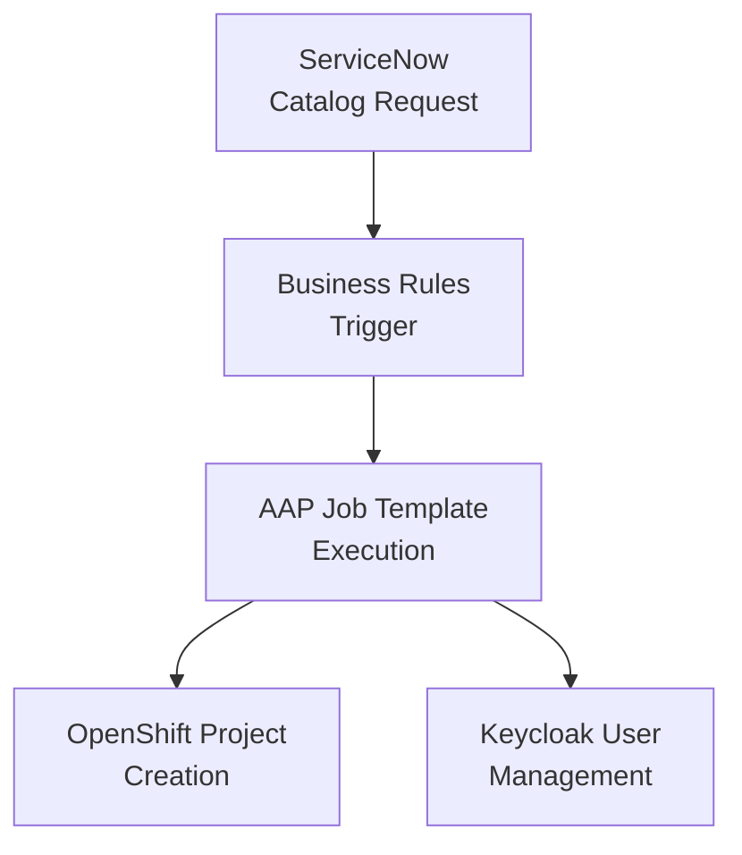

# Getting Started with ServiceNow-OpenShift Integration

This is a **quick overview** to get you started with the ServiceNow-OpenShift integration. This tutorial provides a streamlined path through the complete setup process.

## What You'll Build

A complete ServiceNow-OpenShift integration with:
- ✅ **Automated project creation** via ServiceNow catalog requests
- ✅ **Business Rules automation** (95% confidence score)
- ✅ **GitOps infrastructure** deployment
- ✅ **Production-ready workflow** with comprehensive testing

## Prerequisites

Before starting, ensure you have:
- **OpenShift Cluster** with admin access (`oc login` working)
- **ServiceNow Developer Instance** (PDI) with admin access
- **Linux environment** with Ansible and oc CLI installed
- **Basic knowledge** of ServiceNow, Ansible, and OpenShift concepts

## Quick Start Options

Choose your preferred approach:

### Option A: Step-by-Step Tutorial (Recommended for Learning)
Follow the focused tutorials below in order for a guided learning experience.

### Option B: Complete Implementation Guide
For experienced users, jump directly to the [Implementation Guide](../GETTING_STARTED.md) for the full step-by-step process.

## Step-by-Step Tutorial Path

### 1. 🏗️ Infrastructure Setup
**Goal**: Deploy core infrastructure via GitOps

**What you'll do**:
- Deploy ArgoCD app-of-apps
- Install Ansible Automation Platform (AAP)
- Set up Red Hat SSO (Keycloak)
- Configure External Secrets Operator

**Time**: ~20 minutes
**Reference**: [Implementation Guide - Section 2](../GETTING_STARTED.md#2-deploy-infrastructure-via-gitops)

### 2. 🔐 Credential Configuration
**Goal**: Configure all required credentials securely

**What you'll do**:
- Set up ServiceNow admin credentials
- Configure Keycloak/RH-SSO passwords
- Generate OpenShift tokens
- Create AAP API tokens (critical for ServiceNow integration)

**Time**: ~15 minutes
**Reference**: [Ansible Vault Configuration Guide](ansible-vault-configuration.md)

### 3. ⚙️ Infrastructure Configuration
**Goal**: Configure deployed infrastructure using Ansible

**What you'll do**:
- Run pre-flight connectivity checks
- Configure RH-SSO realms and clients
- Set up OpenShift OIDC integration
- Configure ServiceNow OAuth integration
- Set up AAP projects and job templates

**Time**: ~30 minutes
**Reference**: [Implementation Guide - Sections 5-8](../GETTING_STARTED.md#5-prerequisite-configure-base-rh-sso-realms-and-clients)

### 4. 🔧 ServiceNow Integration
**Goal**: Set up ServiceNow Business Rules and catalog items

**What you'll do**:
- Configure Business Rules for automation
- Create catalog items
- Set up AAP job template integration

**Time**: ~25 minutes
**Reference**: [Business Rule Logic Documentation](../how-to/business-rule-logic.md)

### 5. ✅ End-to-End Testing
**Goal**: Validate the complete integration

**What you'll do**:
- Execute comprehensive test suite
- Validate production workflow
- Review troubleshooting procedures

**Time**: ~15 minutes
**Reference**: [End-to-End Test Guide](../how-to/end-to-end-testing.md)

## Architecture Overview



## Total Time Estimate
**~105 minutes** (1 hour 45 minutes) for complete setup

## Success Criteria

✅ **You're successful when:**
1. Infrastructure deployed via GitOps (ArgoCD, AAP, RH-SSO, ESO)
2. All credentials properly configured in Ansible vault
3. Infrastructure components configured and integrated
4. ServiceNow catalog request creates OpenShift projects
5. End-to-end test shows 95%+ confidence score
6. All validation steps pass

## Validation Results

This tutorial is based on **validated implementation** documented in [End-to-End Test Execution Summary](../END_TO_END_TEST_EXECUTION_SUMMARY.md):
- **95% confidence score** from comprehensive testing
- **Production-ready** Business Rules implementation
- **Comprehensive error handling** and fallback mechanisms
- **Full integration** across ServiceNow → AAP → OpenShift → Keycloak

## Need Help?

- 📖 **[How-to Guides](../how-to/index.md)** - Specific tasks and solutions
- 🔧 **[Reference](../reference/index.md)** - API docs and configuration
- 🏗️ **[Architecture](../explanation/architecture-overview.md)** - Design decisions
- 📋 **[Complete Implementation Guide](../GETTING_STARTED.md)** - Detailed step-by-step process

---
*Based on validated implementation with 95% confidence score*

## Detailed Implementation Steps

### Step 1: Infrastructure Deployment

Deploy the core infrastructure using GitOps:

```bash
# Deploy via ArgoCD app-of-apps
oc apply -k kustomize/argocd/apps/
```

Wait for deployments in `sso`, `aap`, and `external-secrets-operator` namespaces to become healthy.

### Step 2: Credential Configuration

Set up all required credentials following the [Ansible Vault Configuration Guide](ansible-vault-configuration.md):

```bash
# Copy the vault template
cp ansible/group_vars/all/vault.yml.template ansible/group_vars/all/vault.yml

# Edit vault file with your credentials (see guide for details)
vi ansible/group_vars/all/vault.yml

# Encrypt the vault file (NEVER commit unencrypted!)
ansible-vault encrypt ansible/group_vars/all/vault.yml --vault-password-file .vault_pass
```

**Critical**: Ensure you create the AAP API token as described in the vault configuration guide - this is essential for ServiceNow integration.

### Step 3: Infrastructure Configuration

Run the configuration playbooks in sequence:

```bash
# 1. Pre-flight checks
./run_playbook.sh ../ansible/preflight_checks.yml \
  -e @../ansible/group_vars/all/vault.yml \
  --vault-password-file ../.vault_pass -m stdout

# 2. Configure base RH-SSO realms and clients
./run_playbook.sh ../ansible/playbook.yml \
  -e @../ansible/group_vars/all/vault.yml \
  --vault-password-file .vault_pass -m stdout

# 3. Configure OpenShift OIDC with Keycloak
./run_playbook.sh ../ansible/openshift_oidc_playbook.yml \
  -e @../ansible/group_vars/all/vault.yml \
  --vault-password-file .vault_pass -m stdout

# 4. Configure ServiceNow and Keycloak OAuth integration
./run_playbook.sh ../ansible/oauth_integration_playbook.yml \
  -e @../ansible/group_vars/all/vault.yml \
  --vault-password-file .vault_pass -m stdout

# 5. Configure Ansible Automation Platform (AAP)
./run_playbook.sh ../ansible/configure_aap.yml \
  -e @../ansible/group_vars/all/vault.yml \
  --vault-password-file .vault_pass -m stdout
```

### Step 4: ServiceNow Integration

Configure ServiceNow Business Rules and catalog items:

**Important**: This project uses **Business Rules**, not Flow Designer, based on comprehensive research (see [ADR-014](../adrs/014-business-rules-over-flow-designer.md)).

**Why Business Rules?**
- Direct state change triggers (no additional layers needed)
- Better alignment with GitOps principles (code-based, version controlled)
- Superior error handling and debugging capabilities
- No PDI environment limitations

```bash
# Configure Business Rules for AAP integration
./run_playbook.sh ../ansible/servicenow_business_rules_setup.yml \
  -e @../ansible/group_vars/all/vault.yml \
  --vault-password-file ../.vault_pass -m stdout

# Create ServiceNow catalog items
./run_playbook.sh ../ansible/servicenow_catalog_setup.yml \
  -e @../ansible/group_vars/all/vault.yml \
  --vault-password-file ../.vault_pass -m stdout
```

**Validation Steps**:
1. Navigate to ServiceNow: **System Definition > Business Rules**
2. Look for: "OpenShift Project AAP Trigger"
3. Ensure it's **Active** and configured for the `sc_req_item` table

For detailed Business Rules implementation, see [Business Rule Logic Documentation](../how-to/business-rule-logic.md).

### Step 5: End-to-End Testing

Execute the comprehensive test suite to validate the complete integration:

```bash
# Run the validated end-to-end test (95% confidence score)
./run_playbook.sh ../ansible/idempotent_end_to_end_test.yml \
  -e @../ansible/group_vars/all/vault.yml \
  --vault-password-file ../.vault_pass -m stdout
```

**Tag-based testing** for targeted debugging:

```bash
# Test setup configuration
./run_playbook.sh ../ansible/idempotent_end_to_end_test.yml --tags "setup" \
  -e @../ansible/group_vars/all/vault.yml \
  --vault-password-file ../.vault_pass -m stdout

# Test catalog creation
./run_playbook.sh ../ansible/idempotent_end_to_end_test.yml --tags "catalog" \
  -e @../ansible/group_vars/all/vault.yml \
  --vault-password-file ../.vault_pass -m stdout
```

For detailed testing procedures, see the [End-to-End Test Guide](../how-to/end-to-end-testing.md).

## Production Workflow Testing

Test the complete workflow using the validated approach:

```bash
# Test complete workflow (PDI-compatible approach)
./user-workflows/advanced/start-simplified-workflow.sh test-project development full

# Verify OpenShift project creation
oc get projects | grep test-project
oc describe project test-project

# Use comprehensive verification script
./verify_complete_servicenow_integration.sh
```

## Validation and Monitoring

**Check ServiceNow Request Status**:
- Navigate to your ServiceNow instance
- Go to **Service Catalog > Requests**
- Look for your test request (e.g., REQ0010044)
- Verify status progression: Requested → In Process → Completed

**Monitor AAP Job Execution**:
```bash
# Check AAP connectivity and job status
./debug/aap/01-check-aap-connectivity.sh
./debug/aap/02-check-specific-job.sh [JOB_ID]
```

## Final Success Validation

✅ **You've successfully completed the tutorial when:**
1. ServiceNow request created (REQ number generated)
2. Business Rules trigger AAP job template
3. OpenShift project created and accessible
4. End-to-end test shows 95%+ confidence score
5. All validation steps pass

## Troubleshooting

For common issues and solutions:

### Infrastructure Issues
- **ArgoCD Applications Not Syncing**: Check application status and server logs
- **AAP Pods Stuck in Pending**: Usually storage-related, check PVCs in AAP namespace
- **RH-SSO/Keycloak Not Starting**: Check Keycloak instance status and operator logs

### ServiceNow Integration Issues
- **Business Rules Not Triggering**: Use simplified workflow as PDI workaround
- **AAP Authentication Errors**: Verify AAP API token configuration in vault
- **OpenShift Project Creation Fails**: Check oc CLI authentication and permissions

### Ansible Playbook Issues
- **Vault Password Errors**: Verify vault file permissions and test decryption
- **Connectivity Issues**: Re-run preflight checks to validate connections

For detailed troubleshooting procedures, see the [Implementation Guide](../GETTING_STARTED.md#troubleshooting).

## Next Steps

After completing this tutorial:
- 📖 **[How-to Guides](../how-to/index.md)** - Production deployment guides
- 🔧 **[Reference](../reference/index.md)** - API documentation and configuration
- 🏗️ **[Architecture](../explanation/architecture-overview.md)** - Deep dive into design decisions
- 📋 **[Implementation Guide](../GETTING_STARTED.md)** - Detailed step-by-step process

---
*Based on validated implementation with 95% confidence score - September 19, 2025*