# 🚀 Your First ServiceNow-OpenShift Project

**A complete beginner's guide to creating your first project using the ServiceNow-OpenShift integration**

## 🎯 What You'll Learn

By the end of this tutorial, you'll have:
- ✅ Created a ServiceNow catalog request for an OpenShift project
- ✅ Executed the automated workflow using the simplified script
- ✅ Verified your project creation in OpenShift
- ✅ Understood the development workflow approach

**⏱️ Estimated Time**: 15-20 minutes

## 📋 Prerequisites

Before starting, ensure you have:

### Required Access
- [ ] **ServiceNow PDI account** (Personal Developer Instance)
- [ ] **OpenShift cluster access** with `oc` CLI configured
- [ ] **Terminal/command line access** to the project repository
- [ ] **Basic understanding** of ServiceNow navigation

### Development Environment Note
This tutorial uses the **PDI workaround strategy** (ADR-013) because ServiceNow Personal Developer Instances have limitations with outbound REST API calls. In production environments, this workflow would be fully automated through Business Rules.

### What You Don't Need
- ❌ Production ServiceNow instance
- ❌ Advanced Kubernetes knowledge
- ❌ Ansible expertise
- ❌ Administrative privileges

## 🎬 Step 1: Access the ServiceNow Service Catalog

### 1.1 Log into ServiceNow PDI

1. Open your browser and navigate to your ServiceNow PDI instance
   - Example: `https://dev295398.service-now.com`
2. Log in with your PDI credentials
3. You should see the ServiceNow homepage

### 1.2 Navigate to Service Catalog


1. Click on **"Service Catalog"** in the main navigation
2. Look for **"OpenShift Services"** category
3. Click on **"Basic OpenShift Project Request"**

### 1.3 What You'll See

The catalog item form will display with several fields:
- **Project Name** (required)
- **Business Justification** (required)
- **Project Description** (optional)
- **Additional Users** (optional)

**Note**: In the PDI environment, this request will be created but won't automatically trigger the AAP job due to PDI limitations. We'll handle the automation in Step 4.

## 🎬 Step 2: Fill Out Your Project Request

### 2.1 Choose a Project Name

**Best Practices:**
- Use lowercase letters and hyphens only
- Keep it descriptive but concise
- Examples: `my-first-app`, `team-dashboard`, `test-environment`

```bash
# Good examples:
my-first-project
web-application-dev
data-processing-test

# Avoid these:
MyProject (uppercase)
my_project (underscores)
project with spaces (spaces)
```

### 2.2 Provide Business Justification

**Example justifications:**
```text
"Learning OpenShift platform capabilities for future application deployment"

"Development environment for new microservices application"

"Testing container deployment workflows for team training"
```

### 2.3 Add Project Description (Optional)

```text
"This project will be used to deploy and test a simple web application 
as part of learning OpenShift container platform capabilities."
```

### 2.4 Additional Users (Optional)

If you want to grant access to teammates:
- Enter their ServiceNow usernames
- Separate multiple users with commas
- Example: `john.doe, jane.smith`

## 🎬 Step 3: Submit Your Request

### 3.1 Review Your Information

Double-check:
- [ ] Project name follows naming conventions
- [ ] Business justification is clear and professional
- [ ] Additional users (if any) are spelled correctly

### 3.2 Submit the Request

1. Click **"Order Now"** button
2. You'll see a confirmation message
3. Note your **Request Number** (e.g., REQ0001234)

### 3.3 What Happens in PDI Environment


**PDI Workflow Steps:**
1. **Request Creation** in ServiceNow (immediate)
2. **Manual Script Execution** (you'll do this in Step 4)
3. **User Account Creation** in Keycloak (1 minute)
4. **OpenShift Project Creation** (1 minute)
5. **Permission Assignment** (30 seconds)

## 🎬 Step 4: Execute the Simplified Workflow

### 4.1 Open Terminal and Navigate to Project

1. Open your terminal/command line
2. Navigate to the project directory:
   ```bash
   cd /path/to/servicenow-ocp-service
   ```
3. Ensure you're logged into OpenShift:
   ```bash
   oc whoami
   # Should show your username
   ```

### 4.2 Run the Simplified Workflow Script

Execute the working script that handles the automation:

```bash
# Navigate to the workflow directory
cd user-workflows/advanced/

# Run the simplified workflow script
./start-simplified-workflow.sh my-first-project development full
```

**Script Parameters:**
- `my-first-project`: Your project name (use the same name from ServiceNow)
- `development`: Environment (development/staging/production)
- `full`: Mode (full workflow with request creation and validation)

### 4.3 What the Script Does


**Expected Output:**
```bash
🚀 Starting ServiceNow-OpenShift Integration Workflow
📋 Project: my-first-project
🌍 Environment: development
🔄 Mode: full

✅ ServiceNow request found: REQ0001234
✅ AAP job template triggered successfully
✅ Keycloak user created: your-username
✅ OpenShift project created: my-first-project
✅ RBAC configured: admin permissions granted
✅ Integration verified: End-to-end test passed

🎉 Project ready! Access via OpenShift console.
```

## 🎬 Step 5: Access Your New Project

### 5.1 Get Your OpenShift Console URL

From the completion email, click the **OpenShift Console** link, or:

1. Navigate to: `https://console-openshift-console.apps.your-cluster.com`
2. Click **"Log in with Keycloak"**
3. Use your ServiceNow credentials

### 5.2 Verify Your Project Access

```mermaid
flowchart TD
    A[OpenShift Console] --> B{Login Successful?}
    B -->|Yes| C[View Projects List]
    B -->|No| D[Check Credentials]
    C --> E{See Your Project?}
    E -->|Yes| F[✅ Success!]
    E -->|No| G[Wait 5 minutes, refresh]
    D --> A
    G --> C
    
    style F fill:#c8e6c9
    style D fill:#ffecb3
    style G fill:#ffecb3
```



**What to look for:**
1. Your project appears in the projects list
2. You can click on it and see the project overview
3. You have "Admin" role in the project

### 5.3 Explore Your Project

**Key areas to explore:**
- **Overview**: Project summary and resource usage
- **Workloads**: Where your applications will run
- **Networking**: Services and routes
- **Storage**: Persistent volumes
- **Administration**: Project settings and permissions

## 🎬 Step 6: Deploy Your First Application

### 6.1 Quick Application Deployment

Let's deploy a simple "Hello World" application:

1. In your project, click **"Add"** → **"Container Image"**
2. Enter image name: `quay.io/redhat-training/hello-world-nginx:v1.0`
3. Set application name: `hello-world`
4. Click **"Create"**

### 6.2 Verify Deployment

```bash
# Your application will go through these phases:
Pending → ContainerCreating → Running
```

1. Go to **Workloads** → **Pods**
2. Wait for your pod to show "Running" status
3. Go to **Networking** → **Routes**
4. Click on the route URL to see your application

### 6.3 Success! 🎉

You should see a "Hello World" webpage, confirming:
- ✅ Your project was created successfully
- ✅ You have proper permissions
- ✅ The integration is working correctly

## 🔧 Troubleshooting Common Issues

### Issue 1: Script Fails to Find ServiceNow Request

**Symptoms:** Script reports "ServiceNow request not found"

**Solutions:**
1. **Verify request number** in ServiceNow "My Requests"
2. **Wait 2-3 minutes** after submitting request
3. **Check ServiceNow credentials** in vault configuration
4. **Run script with correct project name** (must match ServiceNow request)

### Issue 2: AAP Job Template Fails

**Symptoms:** Script reports "AAP job template execution failed"

**Solutions:**
1. **Check AAP credentials** in vault file
2. **Verify AAP controller URL** is accessible
3. **Ensure job template ID 9 exists** in AAP
4. **Check AAP logs** for detailed error information

### Issue 3: Can't Access OpenShift Console

**Symptoms:** Login fails or project not visible

**Solutions:**
1. **Wait 5 minutes** after script completion
2. **Clear browser cache** and try again
3. **Use incognito/private browsing** mode
4. **Verify OpenShift login**: `oc whoami`

### Issue 4: Project Created But No Permissions

**Symptoms:** Can see project but can't deploy applications

**Solutions:**
1. **Check Keycloak user creation** in Keycloak admin console
2. **Verify OIDC integration** is working
3. **Log out and log back in** to refresh permissions
4. **Run script again** with `verify-only` mode

### Issue 5: Script Execution Errors

**Symptoms:** Script fails with permission or command errors

**Solutions:**
1. **Ensure you're in the correct directory**: `user-workflows/advanced/`
2. **Make script executable**: `chmod +x start-simplified-workflow.sh`
3. **Check vault password file**: `.vault_pass` should exist
4. **Verify OpenShift login**: `oc login` before running script

## 🎓 What You've Learned

Congratulations! You've successfully:

### ✅ **ServiceNow Skills**
- Navigated the Service Catalog
- Submitted a project request
- Tracked request status
- Understood approval workflows

### ✅ **OpenShift Skills**
- Accessed the OpenShift console
- Explored project structure
- Deployed your first application
- Verified application deployment

### ✅ **Integration Understanding**
- Experienced the PDI workaround workflow
- Understood the four-tier architecture
- Learned about the simplified workflow script
- Gained troubleshooting experience with development environment

### ✅ **Development Workflow Skills**
- Used the `start-simplified-workflow.sh` script
- Understood PDI limitations and workarounds
- Learned manual AAP job execution
- Experienced end-to-end validation

## 🚀 Next Steps

### **Immediate Next Steps**
1. **Explore OpenShift Features**
   - Try different application deployment methods
   - Experiment with scaling applications
   - Learn about persistent storage

2. **Understand Production Differences**
   - Read [ADR-013: PDI Workaround Strategy](../adrs/013-pdi-workaround-strategy-for-development.md)
   - Learn about [Business Rules implementation](../adrs/014-business-rules-over-flow-designer.md)
   - Understand production automation differences

3. **Advanced Development**
   - Test Business Rules logic locally with `test_business_rule_logic.js`
   - Run end-to-end tests with `ansible/idempotent_end_to_end_test.yml`
   - Explore different workflow modes (check-first, verify-only)

### **Learning Resources**
- **[Getting Started Guide](../GETTING_STARTED.md)** - Complete administrative setup
- **[Keycloak Integration Guide](../KEYCLOAK_INTEGRATION_GUIDE.md)** - Identity management details
- **[End-to-End Test Guide](../how-to/end-to-end-testing.md)** - Comprehensive testing
- **[Architecture Overview](../explanation/architecture-overview.md)** - System design

### **Development Resources**
- **[PDI Alternative Solutions](../PDI_ALTERNATIVE_SOLUTIONS.md)** - Development environment options
- **[Business Rule Logic Documentation](../how-to/business-rule-logic.md)** - Production automation
- **[User Workflows Guide](user-workflows-guide.md)** - Advanced workflow usage

### **Community Resources**
- **[Contributing Guide](../../CONTRIBUTING.md)** - Help improve the project
- **[GitHub Issues](https://github.com/tosin2013/servicenow-ocp-service/issues)** - Report problems or suggestions

---

**🎉 Congratulations on completing your first ServiceNow-OpenShift project using the development workflow!**

You now understand both the development approach (PDI workaround) and the production approach (Business Rules automation). This knowledge will help you contribute to the project and deploy it in enterprise environments.
