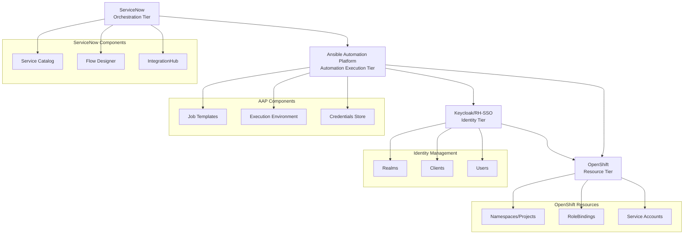
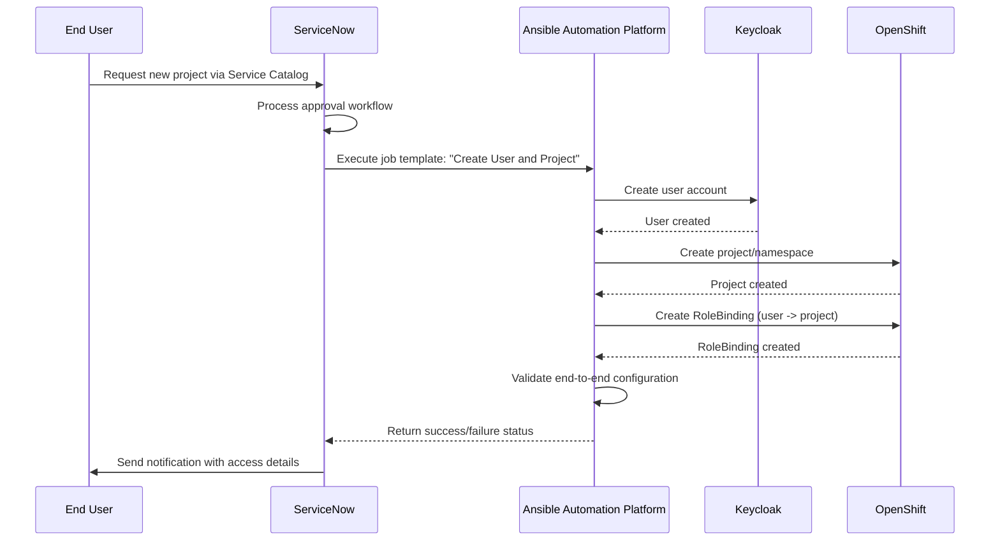
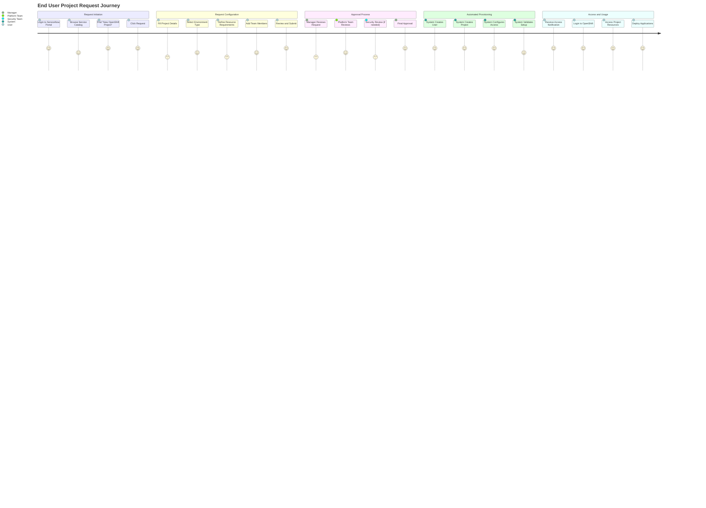
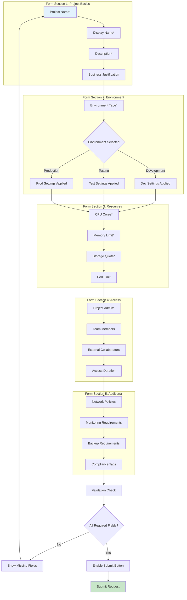
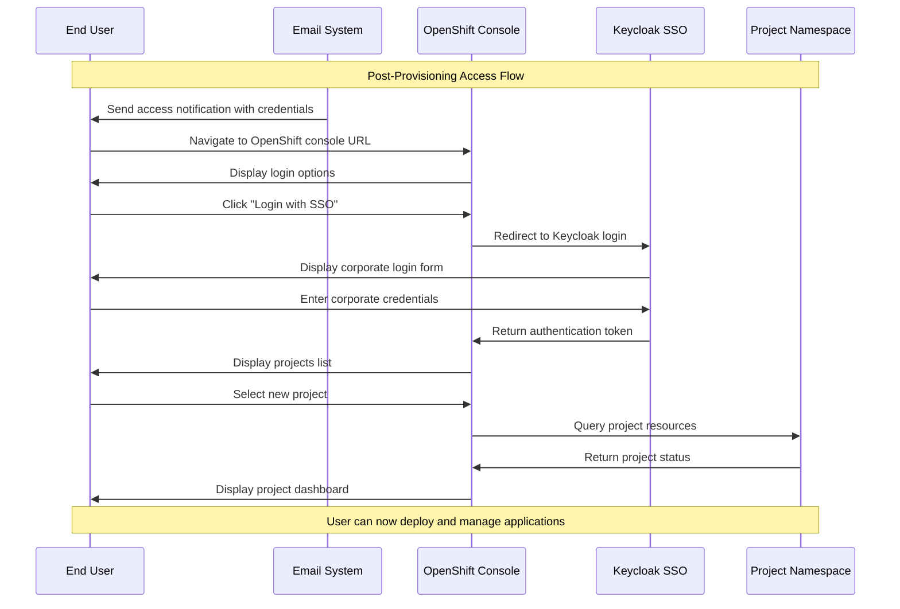
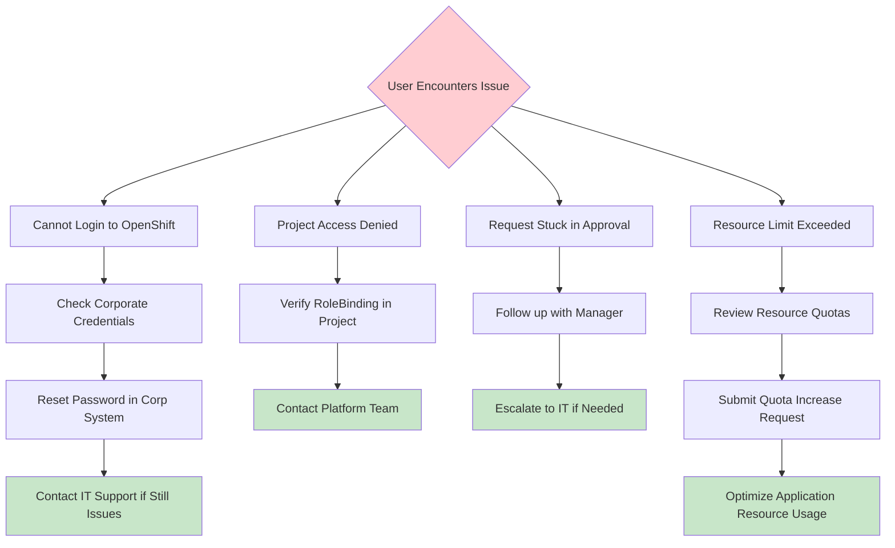

# ServiceNow-OpenShift Integration: Getting Started Guide

This guide provides step-by-step instructions for using the ServiceNow-OpenShift integration system to automatically create users and customized projects through ServiceNow workflows.

## System Overview

The ServiceNow-OpenShift integration implements a four-tier architecture that automates user provisioning and project creation:



## Architecture Flow

The system follows this automated workflow:



## Prerequisites

Before using the system, ensure the following components are deployed and configured:

### 1. Infrastructure Components

- **OpenShift 4.12+** with sufficient resources
- **ArgoCD** for GitOps deployment management
- **External Secrets Operator** for credential management

### 2. Platform Components

- **Ansible Automation Platform** (deployed via kustomize)
- **Red Hat Single Sign-On/Keycloak** (deployed via operator)
- **ServiceNow** (Zurich or later) with Flow Designer and IntegrationHub

### 3. Network and Security

- Network connectivity between ServiceNow and OpenShift cluster
- Proper firewall rules for API communication
- Valid SSL certificates for secure communication

## Deployment Guide

### Step 1: Deploy Core Infrastructure

1. **Deploy ArgoCD** (if not already present):
```bash
oc apply -k kustomize/argocd/
```

2. **Deploy External Secrets Operator**:
```bash
oc apply -k kustomize/external-secrets-operator/
```

### Step 2: Deploy Identity and Automation Tiers

1. **Deploy Keycloak/RH-SSO**:
```bash
oc apply -k kustomize/rhsso/
```

2. **Deploy Ansible Automation Platform**:
```bash
# Deploy operator first
oc apply -k kustomize/ansible-automation-platform/operator/overlays/stable-2.5

# Wait for operator to be ready, then deploy instance
oc apply -k kustomize/ansible-automation-platform/instance/overlays/default
```

### Step 3: Configure Automation

1. **Configure Keycloak** (run after Keycloak is ready):
```bash
ansible-playbook -i inventory ansible/playbook.yml --tags keycloak_config
```

2. **Configure AAP Job Templates** (run after AAP is ready):
```bash
ansible-playbook -i inventory ansible/playbook.yml --tags aap_config
```

### Step 4: ServiceNow Configuration

1. **Configure Connection & Credential Aliases** in ServiceNow:
   - Keycloak Admin API connection
   - OpenShift API connection
   - AAP API connection

2. **Import Flow Designer workflows**:
   - User provisioning flow
   - Project creation flow
   - Validation flow

3. **Configure Service Catalog items** for end-user access

## End-User Experience and Functional Flows

### Complete User Journey

The following diagrams illustrate the complete end-user experience from initial request to project access:



### Detailed User Flow Diagram

```mermaid
flowchart TD
    Start([User needs OpenShift Project]) --> Login[Login to ServiceNow Portal]
    Login --> Catalog[Browse Service Catalog]
    Catalog --> FindItem[Find "New OpenShift Project"]
    FindItem --> ClickRequest[Click "Request Now"]
    
    ClickRequest --> FormPage[Project Request Form]
    FormPage --> FillBasics[Fill Basic Information]
    FillBasics --> FillResources[Specify Resource Requirements]
    FillResources --> AddTeam[Add Team Members]
    AddTeam --> SelectEnv[Select Environment Type]
    SelectEnv --> Review[Review All Details]
    
    Review --> ReviewOK{Details Correct?}
    ReviewOK -->|No| FormPage
    ReviewOK -->|Yes| Submit[Submit Request]
    
    Submit --> ManagerReview[Manager Approval]
    ManagerReview --> ManagerApproved{Manager Approved?}
    ManagerApproved -->|No| Rejected[Request Rejected]
    ManagerApproved -->|Yes| PlatformReview[Platform Team Review]
    
    PlatformReview --> SecurityCheck{Security Review Needed?}
    SecurityCheck -->|Yes| SecurityReview[Security Team Review]
    SecurityCheck -->|No| FinalApproval[Final Approval]
    SecurityReview --> SecurityApproved{Security Approved?}
    SecurityApproved -->|No| Rejected
    SecurityApproved -->|Yes| FinalApproval
    
    FinalApproval --> AutoProvision[Automated Provisioning Starts]
    AutoProvision --> CreateUser[Create User in Keycloak]
    CreateUser --> CreateProject[Create OpenShift Project]
    CreateProject --> ConfigureRBAC[Configure Role-Based Access]
    ConfigureRBAC --> SetQuotas[Apply Resource Quotas]
    SetQuotas --> ValidateSetup[Validate Complete Setup]
    
    ValidateSetup --> ValidationOK{Validation Passed?}
    ValidationOK -->|No| ProvisioningError[Provisioning Error]
    ValidationOK -->|Yes| NotifyUser[Send Access Notification]
    
    NotifyUser --> UserAccess[User Accesses OpenShift]
    UserAccess --> ProjectReady[Project Ready for Use]
    
    Rejected --> NotifyRejection[Notify User of Rejection]
    ProvisioningError --> NotifyError[Notify Platform Team]
    ProvisioningError --> ManualRemediation[Manual Remediation Required]
    
    style Start fill:#e1f5fe
    style ProjectReady fill:#c8e6c9
    style Rejected fill:#ffcdd2
    style ProvisioningError fill:#ffcdd2
```

### ServiceNow User Interface Flow

```mermaid
flowchart LR
    subgraph "ServiceNow Portal"
        A[Service Catalog Homepage] --> B[IT Services Category]
        B --> C[Development Tools Section]
        C --> D["New OpenShift Project" Item]
        D --> E[Request Form]
    end
    
    subgraph "Request Form Sections"
        E --> F[Project Information]
        F --> G[Resource Requirements]
        G --> H[Team Access]
        H --> I[Environment Configuration]
        I --> J[Review & Submit]
    end
    
    subgraph "Approval Workflow"
        J --> K[Manager Approval]
        K --> L[Platform Team Review]
        L --> M[Security Review (if needed)]
        M --> N[Final Approval]
    end
    
    subgraph "Status Tracking"
        N --> O[Request Status Dashboard]
        O --> P[Progress Notifications]
        P --> Q[Completion Notification]
    end
```

### User Request Form Flow



## Using the System

### Step-by-Step User Guide

#### Step 1: Access ServiceNow Portal

1. **Navigate** to your organization's ServiceNow portal
2. **Login** with your corporate credentials
3. **Go to Service Catalog** from the main menu

#### Step 2: Find and Request OpenShift Project

1. **Browse** to "IT Services" category
2. **Select** "Development Tools" section
3. **Click** on "New OpenShift Project" service item
4. **Click** "Request Now" button

#### Step 3: Complete Request Form

Fill out all required sections of the form:

**Project Information Section:**
- **Project Name**: Unique identifier (e.g., `my-app-dev`)
- **Display Name**: Human-readable name (e.g., `My Application - Development`)
- **Description**: Clear project description and purpose
- **Business Justification**: Why this project is needed

**Environment Configuration:**
- **Environment Type**: Select Development, Testing, or Production
- **Expected Duration**: How long the project will be needed
- **Compliance Requirements**: Any special compliance needs

**Resource Requirements:**
- **CPU Cores**: Number of CPU cores needed (1-8 for dev, more for prod)
- **Memory**: RAM allocation (2-16 GB typically)
- **Storage**: Persistent storage needs (10-100 GB)
- **Pod Limit**: Maximum number of pods (10-50 typically)

**Access Management:**
- **Project Administrator**: Primary contact and admin user
- **Development Team**: List of developers who need access
- **External Collaborators**: Any external users requiring access
- **Access Level**: Read-only, Developer, or Admin access per user

#### Step 4: Review and Submit

1. **Review** all entered information for accuracy
2. **Verify** resource requirements match your needs
3. **Confirm** team member access levels
4. **Submit** the request for approval

#### Step 5: Track Request Progress

Monitor your request through the ServiceNow portal:

1. **Check Status**: View current approval stage
2. **Receive Notifications**: Email updates on progress
3. **Respond to Questions**: Answer any clarifying questions
4. **Wait for Completion**: Automated provisioning after approval

#### Step 6: Receive Access Credentials

Once provisioning is complete, you'll receive:

1. **Email Notification** with access details:
   - OpenShift console URL
   - Your username and temporary password
   - Project name and namespace
   - Next steps for accessing your project

2. **ServiceNow Notification** with:
   - Request completion status
   - Link to project documentation
   - Support contact information

### Post-Provisioning User Experience

#### Accessing Your OpenShift Project

```mermaid
flowchart TD
    NotificationReceived[Receive Access Notification] --> OpenConsole[Open OpenShift Console URL]
    OpenConsole --> LoginPage[OpenShift Login Page]
    LoginPage --> SelectKeycloak[Select "Login with SSO"]
    SelectKeycloak --> KeycloakLogin[Keycloak Login Page]
    KeycloakLogin --> EnterCredentials[Enter Corporate Credentials]
    EnterCredentials --> AuthSuccess[Authentication Successful]
    AuthSuccess --> ProjectList[View Available Projects]
    ProjectList --> SelectProject[Select Your New Project]
    SelectProject --> ProjectDashboard[Project Dashboard]
    
    subgraph "Project Dashboard Features"
        ProjectDashboard --> ViewWorkloads[View Workloads]
        ProjectDashboard --> CheckResources[Check Resource Usage]
        ProjectDashboard --> AccessLogs[Access Application Logs]
        ProjectDashboard --> ManageSecrets[Manage Secrets & ConfigMaps]
        ProjectDashboard --> SetupNetworking[Configure Networking]
    end
    
    ViewWorkloads --> DeployApp[Deploy First Application]
    DeployApp --> MonitorApp[Monitor Application Health]
    
    style NotificationReceived fill:#e1f5fe
    style ProjectDashboard fill:#c8e6c9
    style MonitorApp fill:#c8e6c9
```

#### First-Time User Workflow



### ServiceNow Interface Mockups

#### Service Catalog Item Display

```
┌─────────────────────────────────────────────────────────────────┐
│ ServiceNow Service Catalog - IT Services                        │
├─────────────────────────────────────────────────────────────────┤
│                                                                 │
│ 🔧 Development Tools                                            │
│                                                                 │
│ ┌─────────────────┐  ┌─────────────────┐  ┌─────────────────┐  │
│ │ 🐳 New OpenShift │  │ 🗄️  Database    │  │ 🔑 API Keys     │  │
│ │    Project       │  │    Instance     │  │    Request      │  │
│ │                  │  │                 │  │                 │  │
│ │ Request a new    │  │ Request new     │  │ Request API     │  │
│ │ containerized    │  │ database for    │  │ access keys     │  │
│ │ project space    │  │ your project    │  │ for external    │  │
│ │                  │  │                 │  │ integrations    │  │
│ │ [Request Now]    │  │ [Request Now]   │  │ [Request Now]   │  │
│ └─────────────────┘  └─────────────────┘  └─────────────────┘  │
│                                                                 │
└─────────────────────────────────────────────────────────────────┘
```

#### Request Form Interface

```
┌─────────────────────────────────────────────────────────────────┐
│ New OpenShift Project Request                            [Help] │
├─────────────────────────────────────────────────────────────────┤
│                                                                 │
│ Project Information                                             │
│ ┌─────────────────────────────────────────────────────────────┐ │
│ │ Project Name *        [my-app-dev                          ]│ │
│ │ Display Name *        [My Application - Development        ]│ │
│ │ Description *         [Development environment for my new  ]│ │
│ │                       [microservices application           ]│ │
│ │ Business Justification [Supporting Q4 product launch      ]│ │
│ └─────────────────────────────────────────────────────────────┘ │
│                                                                 │
│ Environment Configuration                                       │
│ ┌─────────────────────────────────────────────────────────────┐ │
│ │ Environment Type *    ◉ Development  ○ Testing  ○ Production│ │
│ │ Project Duration      [6 months ▼]                         │ │
│ │ Compliance Required   ☐ PCI-DSS  ☐ HIPAA  ☐ SOX          │ │
│ └─────────────────────────────────────────────────────────────┘ │
│                                                                 │
│ Resource Requirements                                           │
│ ┌─────────────────────────────────────────────────────────────┐ │
│ │ CPU Cores *          [2 ▼]    Memory (GB) *     [4 ▼]     │ │
│ │ Storage (GB) *       [20 ▼]   Pod Limit         [10 ▼]    │ │
│ │                                                             │ │
│ │ 💡 Development environment defaults applied                 │ │
│ └─────────────────────────────────────────────────────────────┘ │
│                                                                 │
│ Team Access Management                                          │
│ ┌─────────────────────────────────────────────────────────────┐ │
│ │ Project Administrator * [john.doe@company.com              ]│ │
│ │                                                             │ │
│ │ Team Members:                                               │ │
│ │ [jane.smith@company.com    ] [Developer ▼] [🗑️]           │ │
│ │ [bob.wilson@company.com    ] [Developer ▼] [🗑️]           │ │
│ │ [+ Add Team Member]                                         │ │
│ └─────────────────────────────────────────────────────────────┘ │
│                                                                 │
│ ┌─────────────────────┐  ┌─────────────────────┐              │
│ │    [← Back]         │  │   [Review & Submit] │              │
│ └─────────────────────┘  └─────────────────────┘              │
└─────────────────────────────────────────────────────────────────┘
```

#### Request Status Tracking

```
┌─────────────────────────────────────────────────────────────────┐
│ Request Status: REQ0001234 - New OpenShift Project             │
├─────────────────────────────────────────────────────────────────┤
│                                                                 │
│ Progress Timeline                                               │
│                                                                 │
│ ✅ Request Submitted          Sep 9, 2025 10:30 AM            │
│    │                                                           │
│ ✅ Manager Approval          Sep 9, 2025 11:15 AM            │
│    │   Approved by: Sarah Johnson                             │
│    │                                                           │
│ 🔄 Platform Team Review     In Progress...                    │
│    │   Assigned to: DevOps Team                               │
│    │   Expected completion: Sep 9, 2025 2:00 PM              │
│    │                                                           │
│ ⏳ Security Review          Pending                           │
│    │                                                           │
│ ⏳ Automated Provisioning   Pending                           │
│    │                                                           │
│ ⏳ Access Notification      Pending                           │
│                                                                 │
│ Request Details                                                 │
│ ┌─────────────────────────────────────────────────────────────┐ │
│ │ Project: my-app-dev                                         │ │
│ │ Environment: Development                                    │ │
│ │ Resources: 2 CPU, 4GB RAM, 20GB Storage                   │ │
│ │ Team Members: 3 developers                                 │ │
│ │ Estimated Completion: Sep 9, 2025 3:00 PM                 │ │
│ └─────────────────────────────────────────────────────────────┘ │
│                                                                 │
│ [📞 Contact Support] [📧 Request Update] [❌ Cancel Request]   │
└─────────────────────────────────────────────────────────────────┘
```

### OpenShift User Experience

#### Project Dashboard After Provisioning

```
┌─────────────────────────────────────────────────────────────────┐
│ OpenShift Container Platform - Project: my-app-dev              │
├─────────────────────────────────────────────────────────────────┤
│ 📊 Overview  🚀 Workloads  🌐 Networking  📦 Storage  ⚙️ Admin  │
├─────────────────────────────────────────────────────────────────┤
│                                                                 │
│ Project Overview                                                │
│                                                                 │
│ ┌─────────────────┐  ┌─────────────────┐  ┌─────────────────┐  │
│ │ 🎯 Quick Start   │  │ 📈 Resource     │  │ 👥 Team Access  │  │
│ │                 │  │    Usage        │  │                 │  │
│ │ • Deploy from   │  │ CPU:  0.1/2.0   │  │ • john.doe      │  │
│ │   Git           │  │ RAM:  0.2/4.0GB │  │   (Admin)       │  │
│ │ • Deploy from   │  │ Storage: 0/20GB │  │ • jane.smith    │  │
│ │   Container     │  │ Pods: 0/10      │  │   (Developer)   │  │
│ │ • Import YAML   │  │                 │  │ • bob.wilson    │  │
│ │                 │  │ [View Details]  │  │   (Developer)   │  │
│ └─────────────────┘  └─────────────────┘  └─────────────────┘  │
│                                                                 │
│ Recent Activity                                                 │
│ ┌─────────────────────────────────────────────────────────────┐ │
│ │ • Project created successfully          2 minutes ago       │ │
│ │ • RBAC configured for team members      2 minutes ago       │ │
│ │ • Resource quotas applied               2 minutes ago       │ │
│ │ • Monitoring enabled                    1 minute ago        │ │
│ └─────────────────────────────────────────────────────────────┘ │
│                                                                 │
│ Getting Started                                                 │
│ ┌─────────────────────────────────────────────────────────────┐ │
│ │ 1. [🚀 Deploy your first application]                       │ │
│ │ 2. [⚙️ Configure CI/CD pipeline]                            │ │
│ │ 3. [🔒 Set up secrets and config maps]                      │ │
│ │ 4. [📊 Enable application monitoring]                       │ │
│ └─────────────────────────────────────────────────────────────┘ │
│                                                                 │
└─────────────────────────────────────────────────────────────────┘
```

### Error Handling and User Support

#### Common User Issues and Solutions



### Request Form Fields

The ServiceNow service catalog item includes:

| Field | Description | Required | Example |
|-------|-------------|----------|---------|
| Project Name | Unique project identifier | Yes | `my-app-dev` |
| Display Name | Human-readable project name | Yes | `My Application - Development` |
| Description | Project description | Yes | `Development environment for my application` |
| Environment Type | Target environment | Yes | `Development/Testing/Production` |
| Resource Quota | CPU/Memory/Storage limits | Yes | `CPU: 2 cores, Memory: 4Gi, Storage: 10Gi` |
| Team Members | Users to grant access | No | `john.doe@company.com, jane.smith@company.com` |
| Project Admin | Primary project administrator | Yes | `project.admin@company.com` |

### Automated Provisioning Process

When a request is submitted and approved, the system automatically:

1. **Creates Keycloak User Account** (if not exists)
2. **Creates OpenShift Project/Namespace**
3. **Applies Resource Quotas and Limits**
4. **Creates RoleBindings** for user access
5. **Sets up Network Policies** (if configured)
6. **Configures Monitoring and Logging**
7. **Sends Access Credentials** to the user

## Access and Management

### User Access

After provisioning, users can access their projects via:

1. **OpenShift Web Console**:
   - Navigate to cluster console URL
   - Login with Keycloak credentials
   - Access assigned projects

2. **OpenShift CLI (oc)**:
```bash
# Login using Keycloak OIDC
oc login --web https://openshift-console.example.com

# Switch to your project
oc project my-app-dev

# Verify access
oc get pods
```

### Administrative Access

Platform administrators can:

1. **Monitor provisioning** via AAP web interface
2. **Review audit logs** in ServiceNow
3. **Manage user access** in Keycloak admin console
4. **Monitor resources** via OpenShift console

## Troubleshooting

### Common Issues

#### 1. Provisioning Fails

**Symptoms**: ServiceNow workflow fails, AAP job shows errors

**Troubleshooting**:
```bash
# Check AAP job execution logs
oc logs -n aap deployment/automation-controller-web

# Check ServiceNow integration logs
# Navigate to ServiceNow > System Logs > Application Logs

# Verify Keycloak connectivity
curl -k https://keycloak.example.com/auth/realms/master
```

#### 2. User Cannot Access Project

**Symptoms**: User receives authentication or authorization errors

**Troubleshooting**:
```bash
# Check RoleBindings in the project
oc get rolebindings -n project-name

# Verify user exists in Keycloak
# Check Keycloak admin console > Users

# Test OIDC configuration
oc get oauth cluster -o yaml
```

#### 3. Resource Quota Issues

**Symptoms**: Deployments fail due to resource constraints

**Troubleshooting**:
```bash
# Check resource quotas
oc describe quota -n project-name

# Check resource usage
oc top pods -n project-name
oc top nodes
```

### Support Contacts

- **Platform Issues**: DevOps Team
- **ServiceNow Issues**: ITSM Team  
- **Identity Issues**: Security Team
- **Application Issues**: Development Team

## Advanced Configuration

### Custom Resource Quotas

Modify resource quotas by updating the AAP job template variables:

```yaml
# In AAP job template extra_vars
resource_quotas:
  cpu: "4"
  memory: "8Gi" 
  storage: "20Gi"
  pods: "10"
```

### Custom RBAC Roles

Define custom roles for specific project needs:

```yaml
# Custom role definition
apiVersion: rbac.authorization.k8s.io/v1
kind: Role
metadata:
  name: custom-developer
rules:
- apiGroups: [""]
  resources: ["pods", "services", "configmaps"]
  verbs: ["get", "list", "create", "update", "delete"]
```

### Multi-Environment Support

Configure different environments with specific settings:

- **Development**: Relaxed quotas, debug enabled
- **Testing**: Production-like quotas, monitoring enabled  
- **Production**: Strict quotas, full security, monitoring, and backup

## Security Considerations

1. **Credential Management**: All credentials stored in External Secrets Operator
2. **Network Security**: Network policies restrict inter-project communication
3. **RBAC**: Principle of least privilege applied to all access
4. **Audit Logging**: Complete audit trail in ServiceNow and OpenShift
5. **Secret Rotation**: Regular rotation of service account tokens and certificates

## Monitoring and Observability

The system provides monitoring through:

1. **OpenShift Built-in Monitoring**: Prometheus metrics and Grafana dashboards
2. **ServiceNow Reporting**: Workflow execution and approval metrics
3. **AAP Analytics**: Job execution statistics and success rates
4. **Keycloak Events**: Authentication and authorization audit logs

Access monitoring dashboards:
- OpenShift: `https://console-openshift-console.apps.cluster.example.com`
- AAP: `https://automation-controller-aap.apps.cluster.example.com`
- ServiceNow: ServiceNow instance dashboard

## Next Steps

After successful deployment and testing:

1. **Scale the solution** to additional use cases
2. **Integrate with CI/CD pipelines** for application deployment
3. **Implement advanced monitoring** and alerting
4. **Configure backup and disaster recovery** procedures
5. **Develop self-service capabilities** for additional resources

For detailed implementation guidance, refer to the individual ADR documents in the `docs/adrs/` directory.
